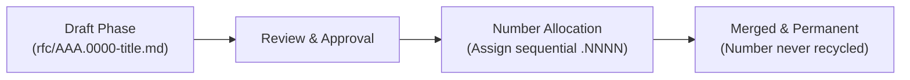

# RFC 000.0001: Flutter Architecture & Reference Taxonomy

## Overview

This document establishes the architecture taxonomy, identification scheme, and allocation process for Flutter Requests for Comments (RFCs).

Every RFC in the Flutter project receives a structured identifier based on the primary architectural subsystem it affects, followed by a zero-padded sequential index:

$$\text{AAA.NNNN}$$

* **AAA (Category & Subcategory):** A three-digit classification representing the Flutter subsystem (e.g., `110` for Framework Foundation, `210` for Graphics Backends).
* **NNNN (Sequential Index):** A four-digit zero-padded number (`0001`–`9999`) representing the proposal within that subcategory.

---

## Architectural Taxonomy

### 000 – General, Process, & Meta

Governance and how the Flutter project itself functions.

* **000:** RFC Process & Templates
* **010:** Governance & Steering Committees
* **020:** Release Cycles & Versioning Policy
* **030:** Breaking Change & Deprecation Policy

### 100 – Flutter Framework Core

The Dart-side architecture of Flutter.

* **110:** Foundation & Low-level (e.g., Binding, Services, PlatformDispatcher)
* **120:** Rendering Layer (e.g., RenderObjects, Layout protocol, Painting)
* **130:** Widget Layer (e.g., Elements, BuildContext, Keys, State primitives)
* **140:** Gestures & Interaction (e.g., Pointer events, GestureArena)
* **150:** Animations & Physics (e.g., AnimationController, Curves, Simulations)
* **160:** Semantics & Accessibility (Framework) (e.g., SemanticsNode, Focus tree, Actions/Shortcuts)
* **170:** Text Editing & Selection (e.g., EditableText, TextSelection, Input formatters)

### 200 – Flutter Engine & Graphics

The C++ core and rendering subsystems.

* **210:** Graphics Backends (e.g., Impeller, Skia, Metal, Vulkan, OpenGL)
* **220:** Layering & Compositing (e.g., SceneBuilder, Display Lists, Flow)
* **230:** Text & Typography (e.g., LibTxt, Paragraph styling, Font fallback)
* **240:** Input & Accessibility Core (Platform input events, OS accessibility bridge)
* **250:** Engine Runtime & Shell (e.g., Dart VM embedding, Isolate lifecycle, Asset resolution)

### 300 – Design Systems & UI

Visual components and user-facing design systems.

* **310:** Platform-Specific Design Systems
* **320:** Adaptive & Multi-platform UI
* **330:** Assets & Images (e.g., AssetBundle, Icon Fonts, Vector graphics)

### 400 – Embedders & Platform Integration

How Flutter integrates with host operating systems and runtimes.

* **410:** Mobile Embedders
* **420:** Web Embedder (e.g., CanvasKit, HTML, Wasm)
* **430:** Desktop Embedders (Windows, macOS, Linux)
* **440:** Plugins & Platform Channels (e.g., Pigeon, FFI / Native Assets)
* **450:** Custom & Embedded Systems (e.g., Automotive, Linux DRM/KMS, TV)

### 500 – Developer Experience & Utilities

The tools and environments developers use to build, test, and debug.

* **510:** Flutter CLI (`flutter` tool)
* **520:** DevTools & Profiling
* **530:** Testing Frameworks (e.g., `flutter_test`, `integration_test`)
* **540:** IDE Plugins & Tooling Protocols (e.g., VS Code, IntelliJ, DDS, DAP, VM Service)

### 600 – Infrastructure & EngProd

The infrastructure that builds, tests, and validates Flutter and Dart SDKs.

* **610:** CI/CD & LUCI Recipes
* **620:** Build Systems (e.g., GN/Ninja, CMake, Gradle)

### 700 – Documentation & Ecosystem

Community, documentation standards, and ecosystem packages.

* **710:** API Documentation Standards & Style Guides
* **720:** pub.dev & Package Ecosystem
* **730:** Localization & Internationalization (i18n / l10n)
* **740:** Community, Outreach & Contributor Programs

---

## RFC Identifier & File Naming Conventions

### 1. Identifier Format

Each RFC is uniquely identified by:

$$\text{AAA.NNNN}$$

* `AAA`: 3-digit subsystem category (e.g., `110`).
* `NNNN`: 4-digit zero-padded index (e.g., `0001`, `0042`).
* Example: `110.0042`
* Example: `000.0001`

### 2. File Path & Naming

RFC files must be placed in the `rfc/` directory using lowercase kebab-case (slugified) format:

$$\text{rfc/AAA.NNNN-title.md}$$

* Example: `rfc/110.0042-extract-value-notifier.md`
* Example: `rfc/000.0001-flutter-architecture-and-reference-taxonomy.md`

Using lowercase kebab-case prevents URL encoding issues (`%20`), simplifies shell automation, and ensures cross-platform filesystem consistency. Zero-padded numbers ensure proper lexicographical sorting.

### 3. Frontmatter Metadata Standard

Every RFC file must begin with YAML frontmatter conforming to this schema, aligned with the Open Knowledge Format (OKF) specification:

```yaml
---
type: rfc
rfc: '110.0042'
title: Extract Value Notifier
description: Extract ValueNotifier and ChangeNotifier into a lightweight foundation package.
status: draft
created: 2026-08-27T00:00:00Z
updated: 2026-08-27T00:00:00Z
tags:
  - 110-foundation
authors:
  - https://github.com/octocat
supersedes: '110.0012' # optional
superseded_by: '110.0050' # optional
---
```

Valid statuses: `draft`, `stable`, `deprecated` (conforming to the Open Knowledge Format status lifecycle). Rejected proposals do not land in the codebase. Timestamps must be formatted as ISO 8601 UTC strings (`YYYY-MM-DDTHH:MM:SSZ`).

#### Author Attribution Formats

The `authors:` list supports two attribution formats:
1. **GitHub User Profile (Preferred):** Full URL to the author's GitHub profile (e.g., `https://github.com/octocat`). This is strongly preferred because it provides durable attribution linked directly to GitHub review activity, mentions, and issue tracking without exposing personal email addresses.
2. **RFC 5322 Mailbox Format:** Display name and email address formatted as `"Display Name" <user@example.com>` (e.g., `'"John McDole" <codefu@google.com>'`).

---

## RFC Number Assignment Process

To prevent race conditions and merge conflicts when multiple proposals are drafted concurrently, numbers follow a simple lifecycle:



1. **Draft Proposal (`AAA.0000`):** An author selects the most applicable 3-digit category `AAA` and creates a PR using `.0000` as the placeholder index:
   * File: `rfc/AAA.0000-my-proposal-title.md`
   * Frontmatter: `rfc: 'AAA.0000'` and `status: draft`
   This ensures concurrent draft PRs in the same subcategory do not conflict on sequential numbers while under review.
2. **Sequential Number Allocation (`AAA.NNNN`):** Immediately prior to merging into `main`, `NNNN` is assigned the next monotonically available number as defined by [RFC 000.0002], and the file name and frontmatter header are updated.
3. **Immutability and Number Retention:** Once assigned and merged into `main`, an RFC number is **permanent**. If an RFC is subsequently deprecated or superseded, the number is **never recycled** or reassigned, preserving persistent permalinks across Flutter documentation, issues, and code comments.

For details on the review process, see [RFC 000.0002: Flutter RFC Review & Decision Process][RFC 000.0002].

[RFC 000.0002]: 000.0002-flutter-rfc-review-process.md

---

## Cross-Cutting Proposals

When a proposal spans multiple subsystems (e.g., Impeller graphics backend work requiring changes in the iOS embedder):
1. **Primary Category:** Assign the RFC number based on the subsystem where the primary architectural impact or implementation effort resides (e.g., `210` Graphics Backends).
2. **Secondary Tagging:** List all other affected subsystems in the `tags:` list of the YAML frontmatter (e.g., `tags: [210-graphics, 420-ios]`).
