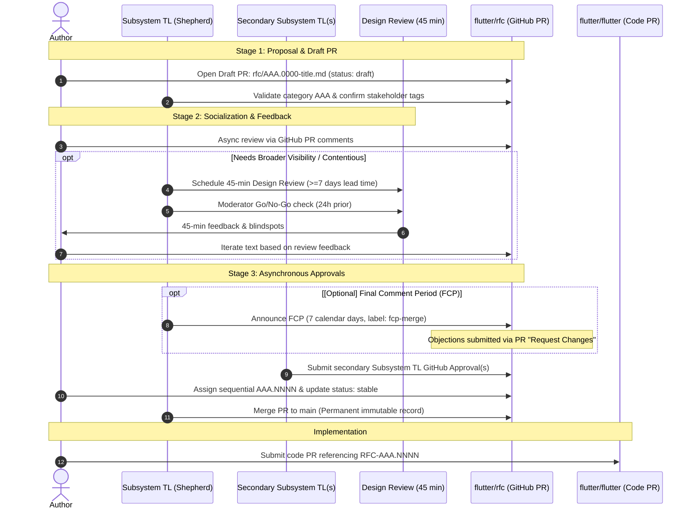

# RFC 000.0002: Flutter RFC Review & Decision Process

## Overview

This document establishes the review, socialization, and decision-making lifecycle for Flutter Requests for Comments (RFCs).

The primary goal of the Flutter RFC process is to **disentangle high-level architectural decision-making from code review**. Settling technical architecture, trade-offs, and subsystem boundaries before code is written ensures that subsequent code reviews on `flutter/flutter`, `flutter/packages`, `flutter/cocoon`, and other Flutter-owned repositories can focus strictly on implementation correctness, code quality, and testing rather than re-litigating design decisions.

To maintain high development velocity and prevent bureaucratic stagnation, this process is engineered to be **lightweight, GitHub-native, and driven by federated Subsystem Tech Leads (TLs)** rather than a centralized council or committee.

### Terminology

The key words "MUST", "MUST NOT", "REQUIRED", "SHALL", "SHALL NOT", "SHOULD", "SHOULD NOT", "RECOMMENDED", "NOT RECOMMENDED", "MAY", and "OPTIONAL" in this document are to be interpreted as described in [BCP 14](https://www.rfc-editor.org/info/bcp14) ([RFC 2119](https://www.rfc-editor.org/info/rfc2119/)).

---

## When to Write an RFC (The Threshold)

The vast majority of engineering tasks in Flutter do **not** require an RFC. The scope and complexity of an engineering initiative determines the appropriate level of design documentation:

| Design Level | Scope & Complexity | Typical Artifact | Review & Approval Mechanism | Requires RFC? |
| :--- | :--- | :--- | :--- | :---: |
| **One-Pager** | Localized feature, bug fix, or refactor contained within a single subsystem. | GitHub Issue or clear PR description | Standard PR code review with Subsystem TL / peer review | **No** |
| **Two-Pager** | Cross-subsystem feature consuming existing APIs in new ways without altering API/ABI contracts. | GitHub Discussion or lightweight design doc | Informal alignment between affected Subsystem TLs | **No** *(Optional)* |
| **Full Design Doc (RFC)** | Architectural changes, cross-subsystem boundary shifts, new primitives, breaking changes, file formats, style guide, or governance. | Version-controlled Markdown in `flutter/rfc` | Formal RFC review, design review meeting (consultative), Subsystem TL approval | **MUST** |

### 1. Does NOT Require an RFC

* **Bug fixes, performance optimizations, and internal refactors** that preserve existing API contracts and subsystem boundaries.
* **One-Pagers**: Localized features or tasks contained within a single subsystem (Category `AAA`). These **SHOULD** be documented directly within a GitHub issue or a clear Pull Request description.
* **Two-Pagers**: Projects with broader scope that consume other teams' APIs or subsystems in new ways without altering their public API/ABI contracts. These **SHOULD** be handled via Discord, GitHub Issues, or lightweight design docs with informal alignment between team TLs. Authors **MAY** optionally author these as lightweight RFCs if they seek broader community feedback, but a formal RFC is not required unless system boundaries or contracts change.

### 2. MUST Require an RFC (Full Design Docs)

A proposal **MUST** go through the RFC process if it meets any of the following criteria:

* **Cross-Subsystem Architectural Impact**: Changes that cross or alter boundaries between major Flutter subsystems (e.g., Framework `100` $\leftrightarrow$ Engine `200`, Engine `200` $\leftrightarrow$ Embedders `400`).
* **New Foundational Primitives**: Introducing new rendering backends, compilers, execution platforms, or embedder shells.
* **File Formats & Protocols**: Specifying, altering, or deprecating file formats, data wire protocols, asset packaging schemes, or tooling interop protocols (e.g., tool daemon protocols, VM Service extensions).
* **Breaking Changes & Deprecations**: Substantive alterations to public API/ABI contracts or project deprecation policies (Category `030`).
* **Governance, Release, & Infrastructure Policies**: Changes to the RFC process, versioning, release cycles, or contributor standards (Category `000`–`020`).
* **Style Guide Changes**: Changes to the Flutter style guide or project-wide formatting standards.

---

## Roles & Responsibilities

* **Author**: Proposes the design, creates the draft PR, drives discussion, and incorporates reviewer feedback. Anyone in the community **MAY** author an RFC.
* **Shepherd**: A maintainer or Subsystem Tech Lead (TL) responsible for the primary taxonomy category `AAA`. The Shepherd ensures process momentum, validates category selection, tags secondary stakeholders, schedules design review meetings when needed, moderates discussion, and initiates the (optional) Final Comment Period (FCP).
* **Subsystem Tech Leads (TLs)**: The technical leads overseeing the domains touched by the proposal.
  * Flutter TLs **SHOULD** know about designs touching their systems.
  * Formal sign-off requires approval from the primary Subsystem TL (or an appointed member) and affected secondary domain TLs (or their appointed members).
* **Flutter TLs Group**: The collective body of Flutter Tech Leads (`flutter-tls`). Serves as the first-line escalation path for deadlocks.
* **Flutter Leads**: The Flutter leadership team. Steps in to resolve disputes **only when requested** by the Flutter TLs group.

---

## The Review Lifecycle



### Stage 1: Proposal & Draft PR (`AAA.0000`)

1. The author selects the primary 3-digit category `AAA` from [RFC 000.0001: Flutter Architecture & Reference Taxonomy](000.0001-flutter-architecture-and-reference-taxonomy.md).
2. The author opens a **Draft Pull Request** against `flutter/rfc`:
   * File path: `rfc/AAA.0000-kebab-case-title.md`
   * Frontmatter: `rfc: 'AAA.0000'`, `status: draft`, author attribution (preferring GitHub profile URL `https://github.com/<username>`, e.g., `https://github.com/octocat`, or RFC 5322 mailbox format), and secondary subsystems listed under `tags:`.
   * The PR description **SHOULD** link to the underlying problem issue in `flutter/flutter` (e.g., `Fixes: flutter/flutter#...`).
3. **Link or File a Tracking Issue in `flutter/flutter`**:
   * Link the RFC PR to an existing issue in `flutter/flutter`, or file a new [issue on flutter/flutter](https://github.com/flutter/flutter/issues) if one does not exist.
   * Apply the `design doc` label to the issue. This notifies subscribers and enters the proposal into Flutter's issue triage queue.
4. **Shepherd Assignment & Triage**:
   * The Primary Subsystem TL for category `AAA` (or their designated delegate) acts as the RFC Shepherd.
   * The Shepherd verifies that category `AAA` is appropriate and ensures that secondary subsystem TLs are tagged as reviewers/approvers on the PR.

> [!NOTE]
> Don't know who the Shepherd is for your RFC? One will be assigned during Flutter's issue triage.

### Stage 2: Socialization & Design Review Meeting

Technical iteration occurs primarily through asynchronous GitHub PR line comments and reviews.

For high-impact, cross-cutting, or contentious proposals requiring broad visibility or synchronous architectural discussion, the proposal **SHOULD** be presented at an **RFC Design Review meeting**. The Shepherd is responsible for scheduling this 45-minute meeting on the appropriate calendar.

#### Design Review Meeting Guidelines

1. **Lead Time**: Authors **SHOULD** have an active `AAA.0000` Draft PR open on GitHub for at least **7 calendar days** prior to the scheduled meeting date to ensure attendees have adequate review time.
2. **Pre-Alignment**: Authors **MUST** pre-align with reviewers and incorporate initial feedback from the Subsystem TLs overseeing the affected systems *before* the meeting is scheduled. Pre-alignment does not mean agreement. It means questions that are answered are resolved and questions that remain are clear discussion topics.
3. **Problem Issue Tagging**: Authors **SHOULD** ensure the tracking issue in `flutter/flutter` has the `design doc` label applied. This alerts external contributors via Discord (`#hidden-chat`) and internal subscribers via the Dart GitHub label notifier.
4. **Moderator Go/No-Go**: 24 hours prior to the meeting, the Shepherd (or assigned meeting moderator) reviews comment progress and makes a **Go/No-Go** decision. If substantive blockers are unresolved, the meeting is postponed to avoid an unproductive session.
5. **Feedback Only**: The design review meeting is **explicitly intended for gathering feedback and surfacing architectural blindspots, NOT for making binding decisions**. Decisions are never made in the meeting; they are finalized asynchronously on the GitHub PR.

### Stage 3: Asynchronous Approvals

Approvals are recorded natively via GitHub PR Reviews. The PR conversation and git commit history serve as the authoritative record.

#### Final Comment Period (OPTIONAL)

When discussion converges and open threads are addressed, the Shepherd **MAY** choose to have a final comment period (FCP) for cooling off.

1. The Shepherd posts a comment on the PR:
   > *"I am proposing to move this RFC into Final Comment Period (FCP) with disposition: MERGE. FCP will close on [Date, 7 calendar days out]."*
2. The Shepherd applies the GitHub label `fcp-merge`.
3. FCP lasts for **7 calendar days**.
4. Bikeshedding (spending an excessive amount of time on minor, trivial details while ignoring complex, important issues) or non-blocking suggestions **SHOULD NOT** delay FCP.

#### Approvals

1. **Required Approvals**:
   * The proposal **MUST** receive formal GitHub PR **Approve** reviews from the primary Subsystem TL (the Shepherd) and at least one Subsystem TL representing each secondary subsystem listed under `tags:`, ensuring that someone from each affected area reviews and approves.
   * **No Pocket Vetos**: Tagged reviewers **MUST** respond with an approval, a change request with technical rationale, or a designated alternate within **7 calendar days total** following the design review meeting (or within 7 calendar days of being tagged for review if no synchronous design review is held). If no response is received within that time, the missing vote is overruled as an abstention, allowing the Shepherd to proceed without blocking the proposal.
2. **Sequential Number Allocation (Pre-Merge Requirement)**:
   * **`AAA.0000` cannot land in `main` and will not be used as a permanent RFC number.** The proposal **MUST** receive a sequential number before merging.
   * Once all required approvals are submitted (and FCP concludes, if initiated), the author inspects merged files in `rfc/` under category `AAA` per the numbering rules in [RFC 000.0001](000.0001-flutter-architecture-and-reference-taxonomy.md).
   * The next available sequential index (`.0001`, `.0002`, ...) is determined.
   * The author renames `rfc/AAA.0000-title.md` to `rfc/AAA.NNNN-title.md` and updates the frontmatter:

     ```yaml
     rfc: 'AAA.NNNN'
     status: stable
     updated: YYYY-MM-DDTHH:MM:SSZ
     ```

3. **Merge**: The Shepherd merges the PR into `main`. Once merged, the RFC number `AAA.NNNN` is permanent and immutable.

---

## Rejections & Withdrawn Proposals

To keep the repository's `main` branch clean and compliant with the Open Knowledge Format (OKF) schema:

* If consensus cannot be reached, an unresolvable blocker emerges, or the author chooses not to proceed, the PR is **closed unmerged**.
* The Shepherd posts a summary comment documenting the consensus findings and technical rationale for rejection.
* The label `status: rejected` or `status: withdrawn` is applied to the closed PR.
* **Because `AAA.0000` cannot land in `main`, no permanent sequential `AAA.NNNN` index is allocated, burned, or left as a gap in `main`.**
* GitHub search permanently preserves the proposal, rationale, and discussion history on the closed PR for future reference.

---

## Escalation & Deadlock Resolution

If the author, Shepherd, or affected Subsystem TLs reach an unresolvable impasse during review or FCP:

1. **First-Line Escalation**: Disagreements **MUST** be escalated to the **Flutter TLs group** (`flutter-tls`). The TL group discusses the disagreement at their weekly sync to forge technical consensus.
2. **Executive Escalation**: The **Flutter Leads** step in to break deadlocks **only when explicitly requested** by the Flutter TLs group.
