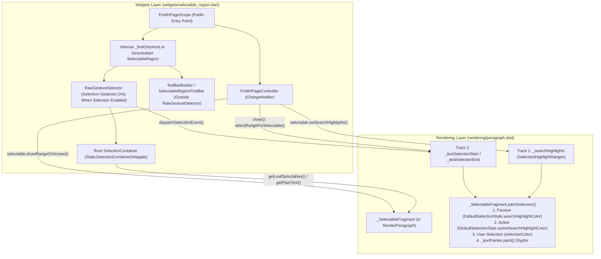

# RFC 170.0000: Pluggable App-Level Find-in-Page (Cmd+F / Ctrl+F) via FindInPageScope & SelectableRegion

## TL;DR (Overview)

Flutter applications on Web (`CanvasKit` / `Skwasm`), Desktop (`macOS`, `Windows`, `Linux`), and Mobile currently lack a built-in way to search rendered text on a page (`Cmd+F` / `Ctrl+F`). Because Flutter renders text glyphs directly onto a GPU canvas rather than the browser DOM, native browser "Find in Page" cannot see Flutter text, highlight occurrences, or scroll Flutter `Viewport`s.

This document proposes a framework-level Find-in-Page subsystem led by `FindInPageScope` and `FindInPageController` in `package:flutter/widgets.dart` and `package:flutter/rendering.dart` ([prototype PR flutter/flutter#193186](https://github.com/flutter/flutter/pull/193186), [live WebAssembly demo](https://kevmoo.github.io/flutter_find_in_page_demo/)):

1. `FindInPageScope` and `FindInPageController` serve as the public entry points. Wrapping a subtree in `FindInPageScope(child: ...)` enables Find-Only mode out of the box (`Cmd+F` highlighting and 2D viewport auto-scrolling without overriding button/chip mouse cursors or adding pointer drag recognizers). Wrapping a `SelectionArea` or `SelectableRegion` inside `FindInPageScope` (or passing `findController` to `SelectableRegion`) upgrades to Selection + Find mode.
2. Find Highlights (`SelectionHighlightRanges`) and User Text Selection (`SelectionGeometry`) remain orthogonal. Both tracks share spatial reading-order discovery (`SelectionRegistrar` in Phase 1, with a non-breaking internal swap path to `TextPluginScope` in Phase 2) while painting developer-configurable, system-adaptive passive and active match highlights (resolved via `DefaultSelectionStyle` across light, dark, and high-contrast themes) directly inside `RenderParagraph` underneath text glyphs prior to `_textPainter.paint`.
3. Viewport "Scanner Mode" (`scannerCacheExtent`) prevents lazy sliver culling while searching. Opening the Find bar temporarily expands descendant `RenderViewport.cacheExtent` (`10000.0` logical pixels above and below the viewport) so `ListView` and `CustomScrollView` items are laid out without painting, preventing match-count drop during scrolling and enabling upward searches from the bottom of a list.
4. Built-in shortcuts and controller state follow standard browser and desktop UX: `FocusAndSelectAll` on repeated `Cmd+F`, incremental typing/backspacing anchor retention, single-line selection seeding on `open()`, active-match selection handoff on `Escape` / `close()`, and `Semantics(liveRegion: true)` screen-reader match announcements.

---

## Background & Context

### The Problem

Over the past five years, [flutter/flutter#65504](https://github.com/flutter/flutter/issues/65504) has accumulated 100+ upvotes and numerous duplicate issues as one of the most frequently cited adoption blockers for Flutter Web and Desktop applications:

- With `CanvasKit` and `Skwasm` (and on native Desktop/Mobile), text is shaped and rasterized by Skia/Impeller onto a `<canvas>` surface. The browser's native `Cmd+F` / `Ctrl+F` searches the HTML DOM, finding `0/0` matches even when text is visibly on screen. Worse, opening the browser's native Find bar over a Flutter Web canvas corrupts Flutter's hidden text editing `<input>` focus state ([flutter/flutter#82708](https://github.com/flutter/flutter/issues/82708)).
- Even if text were mirrored into hidden DOM nodes, the browser has no knowledge of Flutter's `Scrollable` / `RenderViewport` hierarchy (`ListView`, `SingleChildScrollView`, 2D `DataTable`s) and cannot scroll off-screen Flutter widgets into view or map DOM scroll offsets back to arbitrary nested `RenderObject`s.
- Canvas-rendered web applications such as Google Workspace (Docs, Sheets, and Slides) solve this same problem by intercepting `Cmd+F` / `Ctrl+F` at the DOM event boundary and providing an application-managed Find bar that queries their layout model directly, paints match highlights on the canvas, and scrolls virtualized pages, rows, or slides into view.
- As outlined in [flutter/flutter#65504 (comment)](https://github.com/flutter/flutter/issues/65504#issuecomment-1475059683):
  - Scrolling, widget reading order, highlighting, and selection handoff are framework-level concepts that already exist in Flutter's cross-widget selection tree (`SelectionRegistrar` / `SelectableRegion`).
  - Searching UI should not be limited to Web; it should work identically across Web, Desktop, and Mobile.
  - A pure framework implementation triggered via keyboard shortcuts (`Cmd+F` / `Ctrl+F`) and programmatic controller APIs (`FindInPageController`) provides a cross-platform foundation, with optional browser/engine hooks layered on top.

---

## Goals & Non-Goals

### Goals

- Enable `Cmd+F` / `Ctrl+F` across a screen via `FindInPageScope` without requiring developers to manually wire `TextEditingController`s or `GlobalKey`s to individual `Text` widgets.
- Support orthogonal "Find-Only" and "Selection + Find" modes so developers can enable Find-in-Page via standalone `FindInPageScope` without enabling pointer drag-to-select, preserving native pointer cursors (`SystemMouseCursors.click`) on buttons, links, and chips.
- Provide a headless-first `widgets/` architecture (`FindInPageController` and `findBarBuilder`) for custom AppBar/bottom-sheet search bars and themed Material/Cupertino chrome, backed by a minimal zero-dependency fallback (`SelectableRegionFindBar`) in `widgets/`.
- Match desktop and browser Find-in-Page UX invariants:
  - Pressing `Cmd+F` while the Find bar is already open re-focuses the input and selects `0..query.length` (`FocusAndSelectAll`).
  - Pressing `Cmd+F` while single-line text is selected in a `SelectionArea` / `SelectableRegion` populates the Find bar with the selected text and anchors `activeMatchIndex` to that exact occurrence.
  - Typing `'flu'` -> `'flut'` -> `'flu'` keeps `activeMatch` anchored to the current occurrence (or advances forward in reading order if the current occurrence drops out), never yanking the viewport back to match `0`.
  - Pressing `Escape` (or closing the Find bar) returns focus to the region and, when user selection is active (`SelectionArea` / `SelectableRegion`), selects the active match range in the page.

### Non-Goals (Phase 1)

- Unbounded 100k-item virtualized lists beyond `scannerCacheExtent` remain out of scope for Phase 1. `FindInPageController` activates a bounded Viewport Scanner Mode (`scannerCacheExtent = 10000.0` logical pixels above and below the viewport; see [`§ 3.1 Viewport Scanner Mode`](#31-lazy-slivers--viewport-scanner-mode-scannercacheextent)) so typical `ListView`s and `CustomScrollView`s lay out off-screen children without painting them and retain all matches across the scroll range, whereas indexing item 50,000 of an infinite database feed requires an application-level data-source jump protocol.
- Automatic search inside opaque `PlatformView`s (`HtmlElementView` / `WebView` / `<iframe />`) is out of scope because opaque platform views do not build Flutter `RenderParagraph` leaves unless a custom wrapper implements `Selectable` (see [`§ 3.3 Platform Views & Custom Selectables`](#33-platform-views--custom-selectables-htmlelementview--webview)).
- Cross-widget substring concatenation across separate `Text` leaves: Two sibling `Row(children: [Text('Hel'), Text('lo')])` widgets do not match `'Hello'`, whereas `Text.rich(TextSpan(children: [TextSpan(text: 'Hel'), TextSpan(text: 'lo')]))` shares a single `RenderParagraph` fragment and matches `'Hello'`. In Flutter's layout model, separate `Text` widgets are distinct layout boxes analogous to HTML block or table elements (`<div>Hel</div><div>lo</div>` or `<td>24</td><td>ms</td>`), which browsers never concatenate into a single search match; inline styled runs within a single word or sentence use `TextSpan` (analogous to HTML `<span>`). Matching across independent `RenderParagraph` leaves would falsely concatenate adjacent `DataTable` cells, `ListTile` title/trailing labels, and `Chip`s that lack trailing spaces in their string literals, and would split a single active match's `SelectionHighlightRanges` and `showRangeOnScreen` target across independent `Scrollable` viewports.
- Regex and whole-word UI toggles are deferred beyond Phase 1. `FindInPageController` supports `caseSensitive` (`Aa`) initially; regex, whole-word, or diacritic-insensitive matching can be added on `FindInPageController` as non-breaking extensions.

---

## System Architecture: Orthogonality of Selection vs. Find Results

Find-in-Page and User Text Selection share the same spatial discovery tree (`SelectionRegistrar` in Phase 1), but operate as separate state machines:

| Dimension | User Text Selection (`SelectionGeometry`) | Find-in-Page Results (`SelectionHighlightRanges`) |
| :--- | :--- | :--- |
| **Cardinality** | At most **1** contiguous range (`startSelectionPoint` -> `endSelectionPoint`) across the region. | **0 to $N$** disjoint passive match ranges across all leaves, plus **0 or 1** active match range. |
| **Lifecycle & Focus** | Ephemeral: cleared on outside tap (web) or when `SelectableRegion` loses focus (`_handleFocusChanged`). | Persistent while `FindInPageController.isOpen` is `true`, even when focus moves between the FindBar input and the page. |
| **Pointer & Cursor Behavior** | Requires `TapAndPanGestureRecognizer`, `LongPressGestureRecognizer`, mobile drag handles, and `SystemMouseCursors.text` I-beam over text. | Requires **zero** pointer recognizers on page text and **must not** override button/chip mouse cursors in Find-Only mode (`MouseCursor.defer`). |
| **Rendering Layer** | Paints `paragraph.selectionColor` (`#332196F3`) and pushes `LeaderLayer`s (`_startHandleLayerLink` / `_endHandleLayerLink`) requiring `alwaysNeedsCompositing`. | Paints `DefaultSelectionStyle.searchHighlightColor` and `activeSearchHighlightColor` via direct `Canvas.drawRect` calls prior to `_textPainter.paint` (zero `LeaderLayer`s or compositing layers needed). |
| **Handoff Boundaries** | **Source** on `open()`: seeds initial search query and occurrence anchor if single-line selection exists. | **Target** on `close()` / `Escape`: converts `activeMatch` into the live `SelectableRegion` selection when wrapping a `SelectionArea` / `SelectableRegion`. |



---

## Detailed Design & Public API

### 1. Rendering Layer (`package:flutter/rendering.dart`)

#### 1.1 `SelectionHighlightRanges` & `Selectable` Extensions (`rendering/selection.dart`)

Rather than adding new variants to `enum SelectionEventType` (which is implicitly `sealed` in Dart 3 and breaks exhaustive `switch (event.type)` statements in custom `Selectable`s and `SelectionContainerDelegate`s), Find-in-Page adds default no-op methods on `SelectionHandler` and `mixin Selectable`:

```dart
@immutable
class SelectionHighlightRanges {
  const SelectionHighlightRanges({
    this.passiveRanges = const <SelectedContentRange>[],
    this.activeRange,
  });

  static const SelectionHighlightRanges empty = SelectionHighlightRanges();

  final List<SelectedContentRange> passiveRanges;
  final SelectedContentRange? activeRange;
  bool get isEmpty => passiveRanges.isEmpty && activeRange == null;
}

abstract class SelectionHandler implements ValueListenable<SelectionGeometry> {
  // ... existing members ...
  String getPlainText() => '';
}

mixin Selectable implements SelectionHandler {
  // ... existing members ...
  @override
  String getPlainText() => '';

  void setSearchHighlights(SelectionHighlightRanges highlights) {}
  List<Rect> getBoxesForRange(SelectedContentRange range) => const <Rect>[];
  void showRangeOnScreen([SelectedContentRange? range]) {}
  List<Selectable> getLeafSelectables() => <Selectable>[this];
  bool selectRangeForSelectable(Selectable target, SelectedContentRange range) => false;
}
```

#### 1.2 `_SelectableFragment` & `DefaultSelectionStyle` Integration (`rendering/paragraph.dart`, `widgets/default_selection_style.dart`)

Visual highlight styling follows Flutter's existing `DefaultSelectionStyle` -> `RichText` -> `RenderParagraph` pipeline (identical to `selectionColor`), keeping `SelectionHighlightRanges` and `FindInPageController` free of visual `Color` properties:

- **`DefaultSelectionStyle` & Theme Adaptivity**: Adds `Color? searchHighlightColor` and `Color? activeSearchHighlightColor` to `DefaultSelectionStyle` for developer customization, piped through `Text` and `RichText` into `RenderParagraph`. Like `selectionColor`, `MaterialApp` (`TextSelectionThemeData` / `ColorScheme`) and `CupertinoApp` (`CupertinoThemeData`) populate brightness- and high-contrast-adaptive defaults into `DefaultSelectionStyle`, while raw `widgets/` subtrees fall back to `DefaultSelectionStyle.defaultSearchHighlightColor` (`Color(0x66FFEB3B)`) and `defaultActiveSearchHighlightColor` (`Color(0xCCFF9800)`), or high-contrast variants when `MediaQuery.highContrastOf(context)` is active.
- **`getPlainText()`**: Returns `fullText.substring(range.start, range.end)`.
- **`setSearchHighlights(SelectionHighlightRanges highlights)`**: Updates `_searchHighlights` and calls `paragraph.markNeedsPaint()` when changed.
- **`getBoxesForRange(SelectedContentRange contentRange)`**: Maps fragment-local offsets into `paragraph.getBoxesForSelection(...)`.
- **`showRangeOnScreen([SelectedContentRange? contentRange])`**: Expands the bounding `TextBox`es for `contentRange` with vertical clearance (`top: -56.0, bottom: +24.0`) so top-right matches clear floating FindBar overlays and invokes `paragraph.showOnScreen(descendant: paragraph, rect: paddedTarget)`.
- **`paintSelection(PaintingContext context, Offset offset)`**: Called inside `RenderParagraph.paint` **before** `_textPainter.paint(context.canvas, offset)`. Draws passive highlight rects (`paragraph.searchHighlightColor`) first, active highlight rect (`paragraph.activeSearchHighlightColor`) second, and user selection rects (`paragraph.selectionColor`) third.

---

### 2. Widgets Layer (`package:flutter/widgets.dart`)

#### 2.1 Public API: `FindInPageScope` & `FindInPageController`

The public API leads with `FindInPageScope` and `FindInPageController`, avoiding oxymoronic API surfaces like `SelectableRegion.findOnly` or public `SelectableRegion(enableSelection: false)`:

```dart
// 1. Standalone Find-Only mode (zero pointer drag recognizers, preserves button/chip cursors,
//    and requires no SelectionArea or Overlay ancestor):
FindInPageScope(
  controller: _findController, // optional; creates an internal controller if omitted
  findBarBuilder: (context, controller) => MyCustomFindBar(controller: controller), // optional
  child: Scaffold(body: ...),
)

// 2. Selection + Find mode (wrapping an existing SelectionArea or SelectableRegion):
FindInPageScope(
  controller: _findController,
  child: SelectionArea(
    child: Scaffold(body: ...),
  ),
)
```

- Phase 1 internal plumbing (`SelectionRegistrar` + `SelectableRegion._findOnlyHost`):
  - Internally, `FindInPageScope` wraps its child in a library-private `SelectableRegion._findOnlyHost` (`_enableSelection = false`) alongside an inherited scope.
  - When used standalone, `_findOnlyHost` acts as the fallback `SelectionRegistrar` host, discovering descendant `Text` leaves in visual reading order without mounting selection `MouseRegion`s, selection `RawGestureDetector`s, or `SelectionOverlay` handles.
  - When a descendant `SelectionArea` or `SelectableRegion` mounts inside `FindInPageScope`, `FindInPageController` automatically promotes that descendant region to the primary host, preserving I-beam mouse cursors over text, seeding `open()` from active single-line selections, and handing off `activeMatch` to the live `SelectableRegion` selection on `Escape` / `close()`.
  - Because `packages/flutter/lib/src/material/selection_area.dart` is currently frozen during the `material_ui` migration ([flutter/flutter#188444](https://github.com/flutter/flutter/issues/188444)), `FindInPageScope` works with `SelectionArea` today without touching `material/`, and future `SelectionArea(findController: ...)` convenience parameters can wire into the exact same controller contract once `material_ui` unfreezes.
- Phase 2 internal substrate swap (`TextPluginScope`):
  - Because `FindInPageScope` and `FindInPageController` do not expose `SelectionRegistrar` or `SelectableRegion.findOnly` in their public API, the framework can swap `FindInPageController`'s internal leaf-discovery substrate from `SelectionRegistrar` to `TextPluginScope` (`text-plugins-alt`) in Phase 2 as a non-breaking internal refactor (see [`§ 5.1 Phase 2 Substrate Convergence`](#51-phase-2-substrate-convergence-with-textpluginscope)).

#### 2.2 Headless-First `widgets/` Layer & Zero-Dependency `SelectableRegionFindBar` Fallback

`package:flutter/widgets.dart` is designed as a headless-first layer:

- Applications and design-system packages (`material_ui`, `cupertino_ui`) can supply custom or design-themed search chrome (such as an AppBar search field, bottom sheet, or `MaterialFindBar` / `CupertinoFindBar`) via `FindInPageScope.findBarBuilder` or by listening to `FindInPageController` directly (`query`, `matchCount`, `activeMatchIndex`, `caseSensitive`, `nextMatch()`, `previousMatch()`, `close()`).
- While `material_ui` is frozen ([flutter/flutter#188444](https://github.com/flutter/flutter/issues/188444)), `widgets/` provides a minimal, zero-dependency fallback widget (`SelectableRegionFindBar`) when `findBarBuilder` is omitted. It uses universal typographical symbols (`'Aa'`, `'↑'`, `'↓'`, `'×'`), inherits the ambient `DefaultTextStyle`, and reads localized empty-result strings from `WidgetsLocalizations.noResultsFound` (`Localizations.of<WidgetsLocalizations>(context, WidgetsLocalizations)?.noResultsFound`).

---

### 3. Lazy Slivers ("Scanner Mode"), Web `Cmd+F` Interception, and Platform Views

#### 3.1 Lazy Slivers & Viewport "Scanner Mode" (`scannerCacheExtent`)

Even a modest `ListView(children: <Widget>[...])` in Flutter uses `SliverList` (`RenderSliverMultiBoxAdaptor`) with a default `RenderViewport.cacheExtent` of `250.0` logical pixels. Without special handling during an active Find-in-Page session, two failure modes occur:

1. When a user searches from the top of a `ListView` and steps downward (`nextMatch()`), `showRangeOnScreen` scrolls the `ListView` down. Once the top cards scroll more than `250px` above the viewport, `RenderSliverMultiBoxAdaptor.collectGarbage` unmounts and disposes them. Unmounting those `RenderParagraph`s unregisters their `_SelectableFragment`s from `SelectionRegistrar`, causing the match count to drop (`26 -> 12`) and preventing `nextMatch()` at the bottom of the page from ever wrapping back to `scrollOffset: 0` (because match `0` is now near the bottom of the list).
2. If a user scrolls to the bottom of a `ListView` first and then presses `Cmd+F` to search for a word near the top (`"WidgetSpan"`), the top cards lie outside `[scrollOffset - 250.0, scrollOffset + viewportHeight + 250.0]` and are unmounted, returning `0` matches.

Viewport "Scanner Mode" (`scannerCacheExtent`) resolves both failure modes:

- In Flutter's rendering pipeline, `RenderViewport.cacheExtent` defines the pre-render region (`[scrollOffset - cacheExtent, scrollOffset + viewportDimension + cacheExtent]`) where sliver children are built and laid out (`performLayout()`) without being painted (`paint()`).
- When `FindInPageController.isOpen` becomes `true`, `FindInPageController` activates Scanner Mode on descendant `RenderViewport`s inside the scope by expanding their `cacheExtent` to at least `scannerCacheExtent` (default `10000.0` logical pixels, roughly 12 to 15 screens both above and below the visible viewport) and restoring each viewport's original `cacheExtent` when `close()` is called.
- Because `RenderViewport` immediately schedules a layout pass for the expanded cache region (and flushes child `SelectionRegistrar` registrations in the post-frame pass), off-screen `ListView` items in both directions (`up` and `down`) are laid out without painting and remain mounted throughout the Find session. This eliminates the `26 -> 12` match-drop and upward-search blind spot while bounding layout work to `scannerCacheExtent` so infinite lists do not hang the UI thread.

#### 3.2 Browser Native `Cmd+F` Interception & Focus Mechanics on Flutter Web

Phase 1 requires zero changes to `engine/` or `web_ui`. On Flutter Web (`engine/src/flutter/lib/web_ui/lib/src/engine/keyboard_binding.dart`), browser `Cmd+F` / `Ctrl+F` interception works out of the box using the existing key-event contract, without custom JavaScript in `web/index.html`:

- `KeyboardBinding._addEventListeners` (`keyboard_binding.dart:146-160`) registers its `keydown` listener on `domWindow` in the capture phase (`useCapture: true`). When `FindInPageController.defaultRegionShortcuts` handles `Cmd+F` (`KeyEventResult.handled`), `KeyboardBinding` synchronously calls `event.preventDefault()` on the DOM `KeyboardEvent` (`keyboard_binding.dart:596-599`), suppressing the browser's native Find bar across Chrome, Firefox, and Safari and preventing the hidden `<input>` focus corruption tracked in [flutter/flutter#82708](https://github.com/flutter/flutter/issues/82708).
- For `Shortcuts` inside `FindInPageScope` / `SelectableRegion` to receive `Cmd+F` immediately after launch without stealing `autofocus: true` from a descendant `TextField`, the region schedules a post-frame microtask (`_scheduleFallbackFocusIfNeeded`) that flushes `FocusManager.instance.applyFocusChangesIfNeeded()` first and only requests focus on the region's `FocusNode` if `scope.focusedChild == null`.
- In full-page Flutter Web apps (`<body>` owned by `<flutter-view>`), `domWindow` capture-phase key events route directly through `KeyboardBinding` into `FindInPageScope`. In embedded multi-view deployments where `<flutter-view>` is a sub-component inside a larger HTML page, developers can pass `FindInPageController(regionShortcuts: const {})` so the embedded view does not capture `Cmd+F` away from the surrounding HTML document, or coordinate `FindInPageController` (`query`, `nextMatch()`, `previousMatch()`) from the host page via JS interop.

#### 3.3 Platform Views & Custom `Selectable`s (`HtmlElementView` / `WebView`)

- Opaque platform views (`HtmlElementView`, `<iframe />`, `AndroidView`, `UiKitView`) do not create `RenderParagraph` nodes and are not searched automatically.
- Because `FindInPageController` queries `Selectable` leaves (`getPlainText()`, `setSearchHighlights()`, `showRangeOnScreen()`) rather than `RenderParagraph` directly, custom canvas or same-origin DOM wrappers can opt into Find-in-Page by mixing in `Selectable` and registering with `SelectionContainer.maybeOf(context)`.

---

### 4. Performance & Memory Overhead (500-`Text` Microbenchmark)

To quantify the Phase 1 cost of using `SelectionRegistrar` for leaf discovery in Find-Only mode (`FindInPageScope`) versus full `SelectableRegion`, we measured a 500-`Text` scrollable tree across 21 iterations (after 5 warmup runs) in `flutter_test`:

| Configuration (500 `Text` Widgets) | Median Initial Pump (Test JIT VM) | Total `Element`s ($\Delta$/`Text`) | Total `RenderObject`s ($\Delta$/`Text`) | `RenderParagraph`s with `alwaysNeedsCompositing` |
| :--- | ---: | ---: | ---: | ---: |
| **Baseline (`Plain Column`)** | `224.56 ms` | `1,133` (baseline) | `537` (baseline) | `0` |
| **`FindInPageScope` (`Find-Only`, Phase 1)** | `316.25 ms` (`+0.18 ms/Text`) | `3,158` (`+4.0 / Text`) | **`541` (`+0.0 / Text`)** | **`0`** |
| **`SelectableRegion` (`Selection + Find`)** | `377.98 ms` (`+0.31 ms/Text`) | `3,654` (`+5.0 / Text`) | `1,041` (`+1.0 / Text`) | `0` (when unselected) |

Key takeaways:

1. Because `Text.build` skips `MouseRegion` when selection is disabled (`SelectionRegistrarScope._enableSelection == false`) and `RenderParagraph.alwaysNeedsCompositing` is narrowed strictly to active selection handles, `FindInPageScope` adds `0` `RenderObject`s per `Text` (`541` vs. `537` total `RenderObject`s, saving 500 `RenderMouseRegion`s compared to `SelectableRegion`) and `0` compositing layers.
2. In Phase 1, `Text.build` (`widgets/text.dart:756`) wraps `RichText` in `_SelectableTextContainer` whenever `SelectionContainer.maybeOf(context)` is non-null, adding 4 lightweight `Element`s per `Text` (`+0.18 ms/Text` in unoptimized test JIT). Swapping `FindInPageController`'s internal leaf substrate to `TextPluginScope` in Phase 2 (`RichText` -> `RenderParagraph.pluginRegistrars`) eliminates `_SelectableTextContainer` in Find-Only mode, reducing Find-Only overhead to `0` extra `Element`s and `0` extra `RenderObject`s per `Text`.
3. `FindInPageController` caches a `(Selectable, plainText)` snapshot on leaf notifications (`_handleSelectablesChanged`), skipping regex matching during pointer drag-selection when leaf text is unchanged.

---

### 5. Prior Art & Phase 2 Substrate Convergence

#### 5.1 Phase 2 Substrate Convergence with `TextPluginScope`

An experimental framework substrate branch ([`text-plugins-alt`](https://github.com/Renzo-Olivares/flutter/tree/text-plugins-alt)) introduces `TextPlugin`, `TextPluginScope`, `TextPluginRegistrar`, and `TextDelegate` on `RenderParagraph` (`rendering/text_plugin.dart`, `widgets/text_plugin.dart`), citing `SearchInPagePlugin` alongside `_SelectionHighlightTextPlugin`:

- `text-plugins-alt` provides a zero-`Element`-overhead registration and `CustomPainter` decoration substrate (`RichText` passes `TextPluginScope.maybeRegistrarsOf(context)` directly to `RenderParagraph.pluginRegistrars`, painting leaf-first `backgroundPainter`s underneath `_textPainter.paint`), while `RFC 170.0000` ([flutter/flutter#193186](https://github.com/flutter/flutter/pull/193186)) provides the public `FindInPageScope` / `FindInPageController` API, UX state machine, accessibility semantics, and `RenderViewport` Scanner Mode.
- Once `TextPluginScope` lands in `flutter/flutter`, `FindInPageController` can internally migrate from `SelectionRegistrar` to `TextPluginScope` without any public API changes once four mechanisms from `PR #193186` are incorporated into `TextDelegate`:
  1. Because `TextDelegate` is 1-per-`RenderParagraph` (`'a\uFFFCc'`), `outer.compareTo(inner)` returns `-1` (ancestor before child `WidgetSpan`), which would order `'c'` (after the `WidgetSpan`) ahead of `'B'` (inside the `WidgetSpan`). Matches must be ordered by leading `getBoxesForSelection` global coordinates (`D8`) or split across `placeholderRanges`.
  2. `TextDelegate.selection` is currently read-only (`TextSelection? get selection`), which supports seeding `open()`, but needs a write/handoff path (or `SelectionRegistrar` bridge) so closing the FindBar on `Escape` promotes `activeMatch` into the live `SelectableRegion` selection (`D11–D12`).
  3. `TextDelegate.ensureVisible(TextRange range)` calls `paragraph.showOnScreen` with tight `TextBox` bounds; adding `EdgeInsets scrollPadding = EdgeInsets.zero` (`top: -56.0, bottom: +24.0`) prevents top-of-page matches from scrolling underneath the floating `52px` FindBar.
  4. Because `RenderParagraph.dispose()` unregisters `TextDelegate`s (`didRemoveText`) whenever `SliverList.collectGarbage` unmounts items outside `250px`, `FindInPageController`'s `RenderViewport.scannerCacheExtent` expansion (`10000.0` px, `D17`) remains required on top of `TextPluginScope`.

#### 5.2 Why Find-in-Page Cannot Live Only in an External Package

Comparing the community package [`package:find_in_page` (v2.4.0)](https://github.com/Yusufihsangorgel/find_in_page) ([pub.dev](https://pub.dev/packages/find_in_page)) demonstrates why two core primitives belong inside the Flutter framework (`RenderParagraph` and `RenderViewport`):

1. Because an external package cannot paint inside `RenderParagraph.paint` prior to `_textPainter.paint`, `package:find_in_page` wraps the page root in a `RenderHighlightOverlay` (`RenderProxyBox`) that paints translucent `RRect`s after `super.paint` (on top of glyphs, washing out contrast) and outside descendant `Viewport` / `ClipRRect` / `Card` clips. This causes yellow and orange highlight boxes to bleed across sticky headers and outside clipped cards whenever a paragraph is partially scrolled.
2. Standard `ListView` and `ListView.builder` fail in `package:find_in_page` once items scroll past the `250px` cache extent, forcing developers to replace `ListView` with a custom fixed-`itemExtent` `FindableListView` and manually slice `TextSpan`s inside `itemBuilder`.
3. Two details from `package:find_in_page` are incorporated or referenced in this design:
   - Wrapping the match counter in `Semantics(liveRegion: true, label: 'Match X of Y' / 'No results found', child: ExcludeSemantics(...))` (`D18`) announces live match progress while keyboard focus stays inside the Find `TextField` without reading `'1/3'` aloud as *"one third"*.
   - `package:find_in_page`'s offset-mapped `foldForSearch` (`résumé` $\leftrightarrow$ `resume`, `Straße` $\leftrightarrow$ `strasse`, NFC $\leftrightarrow$ NFD) is a useful reference for future `diacriticSensitive` matching on `FindInPageController`.

---

### 6. Core Architectural Invariants & Trade-Offs

The following 8 core architectural invariants govern the design and are verified across `selectable_region_test.dart` (`246/246` passing) and `find_in_page_interaction_test.dart` (`16/16` passing, 0 leaks under `LEAK_TRACKING=true`):

| # | Architectural Area | Chosen Invariant | Rejected Alternative & Why It Failed |
| :- | :--- | :--- | :--- |
| **D1** | **Highlight Dispatch Mechanism** | Direct `Selectable.setSearchHighlights(...)` and `selectRangeForSelectable(...)` methods with default no-ops on `mixin Selectable`. | Adding `searchHighlight` to `enum SelectionEventType`. Because Dart 3 enums are exhaustiveness-checked, adding enum values is a breaking change for every `switch (event.type)` in `flutter/flutter` and third-party packages. |
| **D7** | **Unicode Case-Insensitive Matching** | Use `RegExp(RegExp.escape(_query), caseSensitive: _caseSensitive).allMatches(rawText)` directly against `rawText`. | Searching `rawText.toLowerCase().indexOf(...)`. Length-changing Unicode case folds like Turkish dotted `'İ'` (`\u0130`, length 1 -> `'i\u0307'`, length 2) shift subsequent UTF-16 offsets and crash `rawText.substring` with `RangeError`. |
| **D8** | **Multi-Line `WidgetSpan` Reading Order** | Sort leaf `Selectable`s in `FindInPageController` using each leaf's **leading** bounding box (`selectable.boundingBoxes.first`) in global coordinates. | Sorting by the union bounding box of all lines (`_getBoundingBox`). When `Text.rich` wraps onto Line 2 (`x = 0`) after an inline `WidgetSpan` on Line 1 (`x = 300`), the trailing fragment's union box encloses the `WidgetSpan`, sorting Line 2 matches ahead of Line 1's `WidgetSpan`. |
| **D10** | **Incremental Typing Anchor** | Anchor `activeMatch` to `(leafOrderIndex, startOffset)` in forward reading order (`mLeafIndex == anchorLeafIndex && m.range.startOffset >= anchorStartOffset \|\| mLeafIndex > anchorLeafIndex`). | Checking `SelectableSearchMatch` value equality (`m == previousActive`). Because `SelectableSearchMatch` includes `range.endOffset` and `text`, typing `'flu'` -> `'flut'` always failed equality and reset `activeMatchIndex` to `0`. |
| **D11–D12** | **Selection Seeding & `Escape` Handoff** | Compensate `_pendingAnchorStartOffset` for `trimLeft()` whitespace on `open()`, clear multi-line selections on `open()`, preserve manual user selections on `close()`, and notify `StaticSelectionContainerDelegate.didReceiveSelectionBoundaryEvents()` + `_updateSelectedContentIfNeeded()` on `Escape` handoff. | Leaving multi-line selections active on `open()`, overwriting manual selections on `close()`, or failing to notify `SelectionArea.onSelectionChanged` / `Shift+Click` boundary state when `Escape` converts `activeMatch` into a live selection. |
| **D13** | **Highlight Color Styling (`DefaultSelectionStyle`)** | Add `searchHighlightColor` and `activeSearchHighlightColor` to `DefaultSelectionStyle` and pipe through `RichText` -> `RenderParagraph`, keeping `SelectionHighlightRanges` as pure range data. | Putting `Color` properties on `FindInPageController` or `SelectionHighlightRanges`, which violates Flutter's controller/theme separation (`DefaultSelectionStyle` already owns `selectionColor` and `cursorColor`). |
| **D17** | **Viewport Scanner Mode (`scannerCacheExtent`)** | Temporarily expand descendant `RenderViewport.cacheExtent` to `scannerCacheExtent` (`10000.0` logical pixels) while `FindInPageController.isOpen` is `true`, restoring original `cacheExtent` on `close()`. | Keeping default `cacheExtent: 250.0` during Find-in-Page. Scrolling down a `ListView` caused `SliverList.collectGarbage` to unmount top cards (`26 -> 12` matches) and prevented upward searches from finding off-screen items above the fold. |
| **D18** | **Screen Reader `liveRegion` Match Counter** | Wrap `SelectableRegionFindBar`'s visual `'1 of 3'` / `'0 of 0'` counter in `Semantics(liveRegion: true, label: count == 0 ? localizations.noResultsFound : 'Match ${active + 1} of $count', child: ExcludeSemantics(...))`. | Plain `Text('$current of $total')` without `liveRegion: true`, which left screen reader users without spoken match feedback while typing in the Find `TextField`. |
