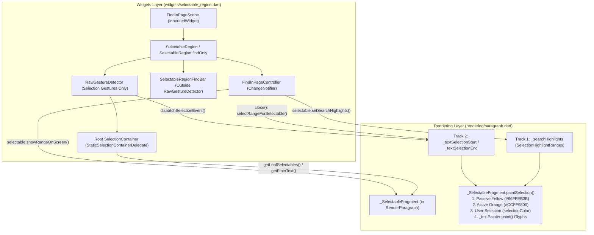

# RFC 170.0000: Pluggable App-Level Find-in-Page (Cmd+F / Ctrl+F) on SelectableRegion & SelectionArea

- **Author**: Kevin Moore (`@kevmoo`)
- **Tracking Issue**: [flutter/flutter#65504](https://github.com/flutter/flutter/issues/65504) (*"Ctrl+F support, finding text on a page (even when scrolled off screen)"*)
- **Prototype PR**: [flutter/flutter#193186](https://github.com/flutter/flutter/pull/193186)
- **Interactive Web/Wasm Demo**: [Live Public Demo](https://kevmoo.github.io/flutter_find_in_page_demo/) ([Source: `kevmoo/flutter_find_in_page_demo`](https://github.com/kevmoo/flutter_find_in_page_demo))
- **Status**: Draft (Pre-Review Working Doc — Distinguishes Verified Prototype Mechanics from `[OPEN QUESTION]` / `[TODO: Needs Grounding]` Areas)

---

## TL;DR (Overview)

Flutter applications on Web (`CanvasKit` / `Skwasm`), Desktop (`macOS`, `Windows`, `Linux`), and Mobile currently lack a built-in way to search rendered text on a page (`Cmd+F` / `Ctrl+F`). Because Flutter renders text glyphs directly onto a GPU canvas rather than the browser DOM, native browser "Find in Page" cannot see Flutter text, highlight occurrences, or scroll Flutter `Viewport`s.

This document proposes a **framework-level Find-in-Page subsystem** (`FindInPageController` and `RenderParagraph` search highlight painting) in `package:flutter/rendering.dart` and `package:flutter/widgets.dart` that:

1. **Reuses `SelectionRegistrar` for logical reading-order discovery** while keeping **Find Highlights** (`SelectionHighlightRanges`) and **User Text Selection** (`SelectionGeometry`) as **orthogonal tracks** on `Selectable` / `RenderParagraph`.
2. **Supports a "Find-Only" mode (`enableSelection: false, enableFind: true`)** enabling `Cmd+F` highlighting and 2D viewport auto-scrolling across a widget subtree **without** turning button/chip mouse cursors into `SystemMouseCursors.text` or competing for pointer drag gestures.
3. **Paints passive (`#66FFEB3B`) and active (`#CCFF9800`) match highlights directly inside `RenderParagraph`** underneath text glyphs prior to `_textPainter.paint`, guaranteeing crisp glyph rendering and automatic clipping by ancestor `Viewport` and `ClipRRect` layers.
4. **Provides a complete, overridable UX & shortcut state machine** matching Chromium, Firefox, and VS Code invariants (`FocusAndSelectAll` on repeated `Cmd+F`, incremental typing/backspacing anchor retention, single-line selection seeding on `open()`, and active-match selection handoff on `Escape` / `close()`).

> [!WARNING]
> **Grounding Status — What Is Empirically Verified vs. What Is Open / Tactical**:
> To keep this design doc honest for framework review, we explicitly separate **verified mechanics** from **tactical prototype workarounds and unverified assumptions**:
>
> - **Grounded & Empirically Verified**: The `RenderParagraph` highlight painting pipeline, the 12 mechanical invariants in [`Key Design Decisions (D1–D12)`](#key-design-decisions--trade-offs-log-empirically-verified-in-prototype), and the 250/250 passing `selectable_region_test.dart` + 16/16 Find-in-Page interaction/golden tests in [flutter/flutter#193186](https://github.com/flutter/flutter/pull/193186).
> - **Needs Architectural Alignment (`[OPEN QUESTION]`)**:
>   - **[OPEN QUESTION 1]**: Should Find-in-Page piggyback on `SelectableRegion` / `FindInPageScope` (which was chosen in the prototype primarily to bypass the `material/` freeze on `SelectionArea`), or should we extract a shared `ContentRegistrar` / standalone `FindArea` widget?
>   - **[OPEN QUESTION 2]**: Should `package:flutter/widgets.dart` include any default visual FindBar (`SelectableRegionFindBar` currently has hardcoded colors, `'Roboto'`, and unlocalized English strings), or should `widgets/` be strictly headless (`FindInPageController` + `findBarBuilder`) with visual chrome in `material_ui` / `cupertino_ui`?
> - **Needs Empirical Benchmarking & Engine Verification (`[TODO: Needs Grounding]`)**:
>   - **[TODO: Needs Benchmark Grounding]**: What is the exact build, layout, layer-count (`alwaysNeedsCompositing`), and memory overhead of registering every `Text` widget with `SelectionRegistrar` in "Find-Only" mode on a 500-`Text` page?
>   - **[TODO: Needs Web Engine Grounding]**: Does handling `Cmd+F` / `Ctrl+F` in Flutter `Shortcuts` reliably call `event.preventDefault()` on the DOM `keydown` event across Chrome, Firefox, and Safari without custom JS in `web/index.html`, and what happens before `<flt-glass-pane>` acquires initial DOM focus?

---

## Background & Context

### The Problem ([flutter/flutter#65504](https://github.com/flutter/flutter/issues/65504))

Over the past five years, [flutter/flutter#65504](https://github.com/flutter/flutter/issues/65504) has accumulated 100+ upvotes and numerous duplicate issues as one of the most frequently cited adoption blockers for Flutter Web and Desktop applications:

- **Canvas Rendering vs. Browser DOM**: With `CanvasKit` and `Skwasm` (and on native Desktop/Mobile), text is shaped and rasterized by Skia/Impeller onto a `<canvas>` surface. The browser's native `Cmd+F` / `Ctrl+F` searches the HTML DOM, finding `0/0` matches even when text is visibly on screen.
- **Scrolling & Lazy Layout**: Even if text were mirrored into hidden DOM nodes, the browser has no knowledge of Flutter's `Scrollable` / `RenderViewport` hierarchy (`ListView`, `SingleChildScrollView`, 2D `DataTable`s) and cannot scroll off-screen Flutter widgets into view or map DOM scroll offsets back to arbitrary nested `RenderObject`s.
- **Architectural Direction**: As `@yjbanov` outlined in [#65504 (comment)](https://github.com/flutter/flutter/issues/65504#issuecomment-1475059683):
  - Scrolling, widget reading order, highlighting, and selection handoff are **framework-level concepts** that already exist in Flutter's cross-widget selection tree (`SelectionRegistrar` / `SelectableRegion`).
  - Searching UI should not be limited to Web; it should work identically across Web, Desktop, and Mobile.
  - A pure framework implementation triggered via keyboard shortcuts (`Cmd+F` / `Ctrl+F`) and programmatic controller APIs (`FindInPageController`) provides a cross-platform foundation, with optional browser/engine hooks layered on top.

---

## Goals & Non-Goals

### Goals

- **Low-friction activation**: Enable `Cmd+F` / `Ctrl+F` across a screen without requiring developers to manually wire `TextEditingController`s or `GlobalKey`s to individual `Text` widgets.
- **Orthogonal "Find-Only" and "Selection + Find" modes**: Allow developers to enable Find-in-Page *without* enabling pointer drag-to-select (`enableSelection: false, enableFind: true`), preserving native pointer cursors (`SystemMouseCursors.click`) on buttons, links, and chips.
- **Headless Controller & Pluggable UI**: Provide `FindInPageController` for full programmatic control and custom AppBar/bottom-sheet search bars.
- **Desktop & Browser-grade UX invariants**:
  - `FocusAndSelectAll`: Pressing `Cmd+F` while the Find bar is already open re-focuses the input and selects `0..query.length`.
  - **Selection Seeding**: Pressing `Cmd+F` while single-line text is selected in the page populates the Find bar with the selected text and anchors `activeMatchIndex` to that exact occurrence.
  - **Incremental Anchor Retention**: Typing `'flu'` -> `'flut'` -> `'flu'` keeps `activeMatch` anchored to the current occurrence (or advances forward in reading order if the current occurrence drops out), never yanking the viewport back to match `0`.
  - **`Escape` Selection Handoff**: Pressing `Escape` (or closing the Find bar) returns focus to the `SelectableRegion` and, when `enableSelection: true`, selects the active match range in the page.

### Non-Goals (Phase 1)

- **Unbounded 100k-item virtualized lists beyond `scannerCacheExtent`**: While `FindInPageController` activates a bounded **Viewport Scanner Mode** (`scannerCacheExtent = 10000.0` logical pixels above and below the viewport — see [`§ 3.1 Viewport Scanner Mode`](#31-lazy-slivers--viewport-scanner-mode-scannercacheextent)) so typical `ListView`s and `CustomScrollView`s lay out off-screen children without painting them and retain all matches across the scroll range, indexing item 50,000 of an infinite/virtualized database feed still requires an application-level data-source jump protocol (out of scope for Phase 1).
- **Automatic search inside opaque `PlatformView`s (`HtmlElementView` / `WebView` / `<iframe />`)**: Opaque platform views do not build Flutter `RenderParagraph` leaves and are excluded unless a custom wrapper implements `Selectable` (see [`§ 3.3 Platform Views & Custom Selectables`](#33-platform-views--custom-selectables-htmlelementview--webview)).
- **Cross-widget substring concatenation across separate `Text` leaves**: Two sibling `Row(children: [Text('Hel'), Text('lo')])` widgets must **not** match `'Hello'` (preventing false matches across adjacent table cells or metric badges), whereas `Text.rich(TextSpan(children: [TextSpan(text: 'Hel'), TextSpan(text: 'lo')]))` shares a single `RenderParagraph` fragment and matches `'Hello'` seamlessly.
- **Regex / Whole-Word UI toggles in Phase 1**: `FindInPageController` supports `caseSensitive` (`Aa`) initially; regex or whole-word matching can be added on `FindInPageController` as a non-breaking extension.

---

## System Architecture: Orthogonality of Selection vs. Find Results

**Find-in-Page and User Text Selection share the same spatial discovery tree (`SelectionRegistrar`), but are separate state machines**:

| Dimension | User Text Selection (`SelectionGeometry`) | Find-in-Page Results (`SelectionHighlightRanges`) |
| :--- | :--- | :--- |
| **Cardinality** | At most **1** contiguous range (`startSelectionPoint` -> `endSelectionPoint`) across the region. | **0 to $N$** disjoint passive match ranges across all leaves, plus **0 or 1** active match range. |
| **Lifecycle & Focus** | Ephemeral: cleared on outside tap (web) or when `SelectableRegion` loses focus (`_handleFocusChanged`). | Persistent while `FindInPageController.isOpen` is `true`, even when focus moves between the FindBar input and the page. |
| **Pointer & Cursor Behavior** | Requires `TapAndPanGestureRecognizer`, `LongPressGestureRecognizer`, mobile drag handles, and `SystemMouseCursors.text` I-beam over text. | Requires **zero** pointer recognizers on page text and **must not** override button/chip mouse cursors in Find-Only mode (`MouseCursor.defer`). |
| **Rendering Layer** | Paints `paragraph.selectionColor` (`#332196F3`) and pushes `LeaderLayer`s (`_startHandleLayerLink` / `_endHandleLayerLink`) requiring `alwaysNeedsCompositing`. | Paints `passiveColor` (`#66FFEB3B`) and `activeColor` (`#CCFF9800`) via direct `Canvas.drawRect` calls prior to `_textPainter.paint` (zero `LeaderLayer`s needed). |
| **Handoff Boundaries** | **Source** on `open()`: seeds initial search query and occurrence anchor if single-line selection exists. | **Target** on `close()` / `Escape`: converts `activeMatch` into the live `SelectableRegion` selection when `enableSelection: true`. |



---

## Detailed Design & Public API

### 1. Rendering Layer (`package:flutter/rendering.dart`) — *Grounded & Verified*

#### 1.1 `SelectionHighlightRanges` & `Selectable` Extensions (`rendering/selection.dart`)

Rather than adding new variants to `enum SelectionEventType` (which is implicitly `sealed` in Dart 3 and breaks exhaustive `switch (event.type)` statements in custom `Selectable`s and `SelectionContainerDelegate`s), Find-in-Page adds default no-op methods on `SelectionHandler` and `mixin Selectable`:

```dart
@immutable
class SelectionHighlightRanges {
  const SelectionHighlightRanges({
    this.passiveRanges = const <SelectedContentRange>[],
    this.activeRange,
  });

  static const SelectionHighlightRanges empty = SelectionHighlightRanges();

  final List<SelectedContentRange> passiveRanges;
  final SelectedContentRange? activeRange;
  bool get isEmpty => passiveRanges.isEmpty && activeRange == null;
}

abstract class SelectionHandler implements ValueListenable<SelectionGeometry> {
  // ... existing members ...
  String getPlainText() => '';
}

mixin Selectable implements SelectionHandler {
  // ... existing members ...
  @override
  String getPlainText() => '';

  void setSearchHighlights(SelectionHighlightRanges highlights) {}
  List<Rect> getBoxesForRange(SelectedContentRange range) => const <Rect>[];
  void showRangeOnScreen([SelectedContentRange? range]) {}
  List<Selectable> getLeafSelectables() => <Selectable>[this];
  bool selectRangeForSelectable(Selectable target, SelectedContentRange range) => false;
}
```

#### 1.2 `_SelectableFragment` & `DefaultSelectionStyle` Integration (`rendering/paragraph.dart`, `widgets/default_selection_style.dart`)

Visual highlight styling follows Flutter's existing `DefaultSelectionStyle` -> `RichText` -> `RenderParagraph` pipeline (identical to `selectionColor`), keeping `SelectionHighlightRanges` and `FindInPageController` free of visual `Color` properties:

- **`DefaultSelectionStyle`**: Adds `Color? searchHighlightColor` (default `Color(0x66FFEB3B)`) and `Color? activeSearchHighlightColor` (default `Color(0xCCFF9800)`), piped through `Text` / `RichText` into `RenderParagraph`.
- **`getPlainText()`**: Returns `fullText.substring(range.start, range.end)`.
- **`setSearchHighlights(SelectionHighlightRanges highlights)`**: Updates `_searchHighlights` and calls `paragraph.markNeedsPaint()` when changed.
- **`getBoxesForRange(SelectedContentRange contentRange)`**: Maps fragment-local offsets into `paragraph.getBoxesForSelection(...)`.
- **`showRangeOnScreen([SelectedContentRange? contentRange])`**: Expands the bounding `TextBox`es for `contentRange` with vertical clearance (`top: -56.0, bottom: +24.0`) so top-right matches clear floating FindBar overlays and invokes `paragraph.showOnScreen(descendant: paragraph, rect: paddedTarget)`.
- **`paintSelection(PaintingContext context, Offset offset)`**: Called inside `RenderParagraph.paint` **before** `_textPainter.paint(context.canvas, offset)`. Draws passive highlight rects (`paragraph.searchHighlightColor`) first, active highlight rect (`paragraph.activeSearchHighlightColor`) second, and user selection rects (`paragraph.selectionColor`) third.

---

### 2. Widgets Layer (`package:flutter/widgets.dart`) — *Contains `[OPEN QUESTION]` Seams*

#### 2.1 `FindInPageScope` & `SelectableRegion.findOnly` (`widgets/selectable_region.dart`)

> [!IMPORTANT]
> **`[OPEN QUESTION 1: Tactical Workaround vs. Long-Term Widget API]`**
> In [flutter/flutter#193186](https://github.com/flutter/flutter/pull/193186), `FindInPageScope` (an `InheritedWidget` that configures a descendant `SelectableRegion`) was introduced primarily because **`packages/flutter/lib/src/material/selection_area.dart` is currently frozen** in `flutter/flutter` during the `material_ui` migration ([flutter/flutter#188444](https://github.com/flutter/flutter/issues/188444)).
>
> **What needs to be decided in framework review**:
>
> - **Option A (Current Prototype)**: Keep `FindInPageScope` + `SelectableRegion.findOnly` + `SelectableRegion(enableSelection: false, enableFind: true)`.
>   - *Pros*: Works today with `SelectionArea` without touching `material/`; zero duplicate registrar trees when both Selection and Find are enabled.
>   - *Cons*: Naming friction (`SelectableRegion(enableSelection: false)` is an oxymoron), and `FindInPageScope` is an indirect way to pass `controller` / `enableSelection` to `SelectionArea`.
> - **Option B (Direct `SelectionArea` Parameters + `FindArea` Widget)**: Once `material_ui` is unfrozen (or if an exception is granted), add `findController` / `enableFind` directly to `SelectionArea`, and introduce a dedicated `FindArea` (or `SearchableRegion`) widget in `widgets/` for "Find-Only" mode rather than `SelectableRegion.findOnly`.
> - **Option C (Converge Substrate on `@Renzo-Olivares`'s `TextPluginScope` / [`text-plugins-alt`](https://github.com/Renzo-Olivares/flutter/tree/text-plugins-alt))**: Wire `FindInPageController` as a `TextPlugin` inside `TextPluginScope` (which hooks directly from `RichText` -> `RenderParagraph.pluginRegistrars` without touching `Text.build` or requiring `SelectableRegion(enableSelection: false)`). See [`§ 4.1 Convergence with TextPluginScope`](#41-convergence-with-renzo-olivaress-textpluginscope-text-plugins-alt) for the exact mapping and the 4 small bridges (`D8`, `D12`, `D16`, `D17`) required.

#### 2.2 `SelectableRegionFindBar` vs. Headless `widgets/` Layer

> [!IMPORTANT]
> **`[OPEN QUESTION 2: Does Default Visual Chrome Belong in package:flutter/widgets.dart?]`**
> The prototype ships `SelectableRegionFindBar` inside `packages/flutter/lib/src/widgets/selectable_region.dart` using universal symbols (`'Aa'`, `'↑'`, `'↓'`, `'×'`) and inheriting the ambient `DefaultTextStyle` so `SelectableRegion.findOnly` and `FindInPageScope` work out-of-the-box without `material/`.
>
> **What needs to be decided in framework review**:
>
> - **Option A (Current Prototype)**: Retain the minimal symbol-based `SelectableRegionFindBar` in `widgets/` as a zero-boilerplate fallback when `findBarBuilder` is omitted.
> - **Option B**: Make `SelectableRegion` in `widgets/` headless by default (requiring `findBarBuilder`), while shipping `MaterialFindBar` (with `MaterialLocalizations` tooltips and `ColorScheme` tokens) in `material_ui` / `SelectionArea` and `CupertinoFindBar` in `cupertino_ui`.

---

### 3. Lazy Slivers ("Scanner Mode"), Embedded HTML + Canvas, and Platform Views

#### 3.1 Lazy Slivers & Viewport "Scanner Mode" (`scannerCacheExtent`)

Even a modest `ListView(children: <Widget>[...])` in Flutter uses `SliverList` (`RenderSliverMultiBoxAdaptor`) with a default `RenderViewport.cacheExtent` of `250.0` logical pixels. Without special handling during an active Find-in-Page session, two severe failure modes occur:

1. **The "One-Way Ratchet Trap" (`26 -> 12 matches`)**: When a user searches from the top of a `ListView` and steps downward (`nextMatch()`), `showRangeOnScreen` scrolls the `ListView` down. Once the top cards scroll more than `250px` above the viewport, `RenderSliverMultiBoxAdaptor.collectGarbage` **unmounts and disposes** them. Unmounting those `RenderParagraph`s unregisters their `_SelectableFragment`s from `SelectionRegistrar`, causing the match count to drop (`26 -> 12`) and preventing `nextMatch()` at the bottom of the page from ever wrapping back to `scrollOffset: 0` (because match `0` is now near the bottom of the list).
2. **Failure to Search "Upward" from the Bottom**: If a user scrolls to the bottom of a `ListView` first and then presses `Cmd+F` to search for a word near the top (`"WidgetSpan"`), the top cards lie outside `[scrollOffset - 250.0, scrollOffset + viewportHeight + 250.0]` and are unmounted, returning `0` matches.

**Framework Solution — Viewport "Scanner Mode" (`scannerCacheExtent`)**:

- In Flutter's rendering pipeline, `RenderViewport.cacheExtent` defines the pre-render region (`[scrollOffset - cacheExtent, scrollOffset + viewportDimension + cacheExtent]`) where sliver children are **built and laid out (`performLayout()`) without being painted (`paint()`)**.
- When `FindInPageController.isOpen` becomes `true`, `FindInPageController` activates **Scanner Mode** on descendant `RenderViewport`s inside the `SelectableRegion` by expanding their `cacheExtent` to at least `scannerCacheExtent` (default **`10000.0` logical pixels** — ~12–15 screens both **above and below** the visible viewport) and restoring each viewport's original `cacheExtent` when `close()` is called.
- Because `RenderViewport` immediately schedules a layout pass for the expanded cache region (and flushes child `SelectionRegistrar` registrations in the post-frame pass), off-screen `ListView` items in both directions (`up` and `down`) are laid out without painting and remain mounted throughout the Find session—eliminating the `26 -> 12` match-drop and upward-search blind spot while bounding layout work to `scannerCacheExtent` so infinite lists do not hang the UI thread.

#### 3.2 Mixed Canvas + HTML in Embedded / Multi-View Mode

- **Full-Page Flutter Web**: When `<flutter-view>` owns `<body>`, intercepting `Cmd+F` inside Flutter (`FindInPageController.defaultRegionShortcuts`) provides a seamless experience because all visible text lives on the Flutter canvas.
- **Embedded / Multi-View Mode**: When a Flutter view is embedded as a sub-component inside a larger HTML document (or alongside multiple `<flutter-view>`s), intercepting `Cmd+F` inside a single `<flutter-view>` opens a view-local Find bar that cannot search surrounding HTML `<div>`s.
  - For embedded deployments, developers can pass `FindInPageController(regionShortcuts: const {})` so the embedded view does not capture `Cmd+F` from the host page, and optionally drive `FindInPageController` (`query`, `nextMatch()`, `previousMatch()`) from a host-level search coordinator via JS interop.

#### 3.3 Platform Views & Custom `Selectable`s (`HtmlElementView` / `WebView`)

- Opaque platform views (`HtmlElementView`, `<iframe />`, `AndroidView`, `UiKitView`) do not create `RenderParagraph` nodes and are not searched automatically.
- Because `FindInPageController` queries `Selectable` leaves (`getPlainText()`, `setSearchHighlights()`, `showRangeOnScreen()`) rather than `RenderParagraph` directly, custom canvas or same-origin DOM wrappers can opt into Find-in-Page by mixing in `Selectable` and registering with `SelectionContainer.maybeOf(context)`.

---

### 4. Prior Art & Ecosystem Alignment (`TextPluginScope` & `package:find_in_page`)

#### 4.1 Convergence with `@Renzo-Olivares`'s `TextPluginScope` ([`text-plugins-alt`](https://github.com/Renzo-Olivares/flutter/tree/text-plugins-alt))

`@Renzo-Olivares` authored an experimental substrate branch ([`Renzo-Olivares/flutter:text-plugins-alt`](https://github.com/Renzo-Olivares/flutter/tree/text-plugins-alt)) introducing `TextPlugin`, `TextPluginScope`, `TextPluginRegistrar`, and `TextDelegate` on `RenderParagraph` (`rendering/text_plugin.dart`, `widgets/text_plugin.dart`), explicitly citing `SearchInPagePlugin` alongside `_SelectionHighlightTextPlugin`:

- **Why `TextPluginScope` & `RFC 170.0000` Are Complementary Layers**:
  - `text-plugins-alt` provides the **low-level registration and `CustomPainter` decoration substrate** (`RichText` passes `TextPluginScope.maybeRegistrarsOf(context)` directly to `RenderParagraph.pluginRegistrars`, leaving `widgets/text.dart` untouched and allocating **zero** `_SelectableTextContainer` / `MouseRegion` / `LeaderLayer` instances per `Text`). Its leaf-first `backgroundPainter` loop (`48f40406455`) paints inner feature plugins (search highlights) first and outer `SelectableRegion` highlights second, all underneath `_textPainter.paint`.
  - `RFC 170.0000` ([flutter/flutter#193186](https://github.com/flutter/flutter/pull/193186)) provides the **complete Find-in-Page controller, UX state machine (`D6–D12`), accessibility semantics (`D4`, `D18`), and `RenderViewport` Scanner Mode (`D17`)**.
- **Four Concrete Bridges Needed to Run `FindInPageController` on `TextPluginScope`**:
  If `TextPluginScope` lands as the underlying substrate (resolving `[OPEN QUESTION 1]` and `[TODO #1]`), `FindInPageController` can swap its leaf adapter from `Selectable` to `TextDelegate` once four empirically verified mechanisms from `PR #193186` are incorporated into `TextDelegate`:
  1. **Inline `WidgetSpan` Sub-Range Ordering (`D8`)**: Because `TextDelegate` is 1-per-`RenderParagraph` (`'a\uFFFCc'`), `outer.compareTo(inner)` returns `-1` (ancestor before child `WidgetSpan`), which would order `'c'` (after the `WidgetSpan`) ahead of `'B'` (inside the `WidgetSpan`). Matches must be ordered by leading `getBoxesForSelection` global coordinates (`D8`) or split across `placeholderRanges`.
  2. **Selection Handoff Write Path (`D11–D12`)**: `TextDelegate.selection` is currently read-only (`TextSelection? get selection`), which supports seeding `open()`, but needs a write/handoff path (or `SelectionRegistrar` bridge) so closing the FindBar on `Escape` promotes `activeMatch` into the live `SelectableRegion` selection.
  3. **`scrollPadding` on `TextDelegate.ensureVisible` (`D16`)**: `TextDelegate.ensureVisible(TextRange range)` calls `paragraph.showOnScreen` with tight `TextBox` bounds; adding `EdgeInsets scrollPadding = EdgeInsets.zero` prevents top-of-page matches from scrolling underneath the floating `52px` FindBar.
  4. **Viewport Scanner Mode (`D17`, `scannerCacheExtent`)**: Because `RenderParagraph.dispose()` unregisters `TextDelegate`s (`didRemoveText`) whenever `SliverList.collectGarbage` unmounts items outside `250px`, `FindInPageController`'s `RenderViewport.scannerCacheExtent` expansion (`10000.0` px) remains essential on top of `TextPluginScope`.

#### 4.2 Why Find-in-Page Cannot Live Only in a Userland Pub Package ([`package:find_in_page` v2.4.0](https://pub.dev/packages/find_in_page))

Comparing the community package [`package:find_in_page` (v2.4.0)](https://github.com/Yusufihsangorgel/find_in_page) demonstrates why two core primitives **must** live inside the Flutter framework (`RenderParagraph` and `RenderViewport`):

1. **Ancestor `RenderHighlightOverlay` Z-Order & Clip Bleed**: Because an external package cannot paint inside `RenderParagraph.paint` prior to `_textPainter.paint`, `package:find_in_page` wraps the page root in a `RenderHighlightOverlay` (`RenderProxyBox`) that paints translucent `RRect`s **after** `super.paint` (on top of glyphs, washing out contrast) and **outside** descendant `Viewport` / `ClipRRect` / `Card` clips—causing yellow/orange highlight boxes to bleed across sticky headers and outside clipped cards whenever a paragraph is partially scrolled.
2. **`ListView` Breakdown without `RenderViewport.scannerCacheExtent`**: Standard `ListView` and `ListView.builder` fail in `package:find_in_page` once items scroll past the `250px` cache extent, forcing developers to replace `ListView` with a custom fixed-`itemExtent` `FindableListView` and manually slice `TextSpan`s inside `itemBuilder`.
3. **Useful Details Adopted / Referenced**:
   - **Screen Reader `Semantics(liveRegion: true)` Match Counter (`D18`)**: Wrapping the match counter in `Semantics(liveRegion: true, label: 'Match X of Y' / 'No matches', child: ExcludeSemantics(...))` announces live match progress while keyboard focus stays inside the Find `TextField` without reading `'1/3'` aloud as *"one third"*. We adopted this directly in `SelectableRegionFindBar` (`D18`).
   - **Unicode Diacritic & Base-Letter Folding (`FoldedText`)**: `package:find_in_page`'s offset-mapped `foldForSearch` (`résumé` $\leftrightarrow$ `resume`, `Straße` $\leftrightarrow$ `strasse`, NFC $\leftrightarrow$ NFD) is a strong reference for Phase 2 `diacriticSensitive` matching on `FindInPageController`.

---

## Key Design Decisions & Trade-Offs Log (Empirically Verified in Prototype)

During implementation and adversarial code review of [flutter/flutter#193186](https://github.com/flutter/flutter/pull/193186), **18 concrete mechanical decisions** were established and validated against `selectable_region_test.dart` (`250/250` passing) and `find_in_page_interaction_test.dart` (`16/16` passing):

<!-- mdformat off(prevent table wrapping) -->
| # | Decision Area | Chosen Design | Rejected Alternative & Why It Failed Empirically |
| :- | :--- | :--- | :--- |
| **D1** | **Highlight Dispatch Mechanism** | Direct `Selectable.setSearchHighlights(...)` and `selectRangeForSelectable(...)` methods with default no-ops on `mixin Selectable`. | Adding `searchHighlight` and `selectContentRange` to `enum SelectionEventType`. Because Dart 3 enums are exhaustiveness-checked, adding enum values broke every `switch (event.type)` in `flutter/flutter` (`selectable_region.0.dart:184`) and third-party packages. |
| **D2** | **`mixin Selectable` Default Bodies** | Explicitly declare `@override String getPlainText() => '';` on `mixin Selectable` in addition to `SelectionHandler`. | Defining `getPlainText() => ''` only on `abstract class SelectionHandler`. In Dart, `class Foo extends RenderProxyBox with Selectable` (`implements SelectionHandler`) inherits the abstract interface signature from `SelectionHandler` unless `mixin Selectable` provides the concrete default body. |
| **D3** | **FindBar Layout Container (`StackFit`)** | Wrap `SelectableRegion` content and `PositionedDirectional(top: 0, end: 0, child: FindBar)` in `Stack(fit: StackFit.passthrough)`. | `Stack(alignment: AlignmentDirectional.topEnd)` (`StackFit.loose`). `StackFit.loose` loosened tight parent constraints (`CrossAxisAlignment.stretch`, `ConstrainedBox`) and right-aligned `widget.child` at `x = 730.0`, breaking 25 tests in `selectable_region_test.dart`. |
| **D4** | **Accessibility / Semantics Tree Preservation** | Pass `includeSemantics: false` on `Shortcuts(includeSemantics: false, shortcuts: findController.regionShortcuts, ...)`. | Default `Shortcuts(...)` (`includeSemantics: true`). `Shortcuts` internally builds a `Focus` widget whose semantics container merged all child `Text` and `Button` `SemanticsNode`s into a single node (`selectable_region_test.dart:467`). |
| **D5** | **Pointer Gesture Isolation for FindBar** | Place `RawGestureDetector` (`TapAndPanGestureRecognizer`) inside `Stack` around **only** the selectable `content`, keeping `SelectableRegionFindBar` as an outer sibling. | Wrapping `RawGestureDetector` around the `Stack` containing `SelectableRegionFindBar`. When `enableSelection: true`, `TapAndPanGestureRecognizer.onTapDown` fired on every mouse click inside `SelectableRegionFindBar` (`↓`/`↑`/`Aa`/`×`), calling `_focusNode.requestFocus()` (stealing primary focus from the FindBar `EditableText`) and collapsing background selection. |
| **D6** | **Non-Stealing Fallback Focus for `Cmd+F`** | Keep `Focus.withExternalFocusNode` at `autofocus: false` and run a post-frame microtask (`_scheduleFallbackFocusIfNeeded`) that calls `FocusManager.instance.applyFocusChangesIfNeeded()` first and only focuses `_focusNode` if `scope.focusedChild == null`. | Setting `autofocus: _effectiveEnableFind` (`true`) on `SelectableRegion`'s `Focus.withExternalFocusNode`. Because ancestor `SelectableRegion` mounts before its descendants, it claimed `scope.focusedChild` first, causing `FocusManager` to discard `autofocus: true` on every child `TextField` / `EditableText` inside a `SelectionArea`. |
| **D7** | **Unicode Case-Insensitive Matching** | Use `RegExp(RegExp.escape(_query), caseSensitive: _caseSensitive).allMatches(rawText)`. | Searching `rawText.toLowerCase().indexOf(_query.toLowerCase())` and slicing `rawText.substring(start, end)`. Characters like Turkish dotted `'İ'` (`\u0130`, length 1) expand to `'i\u0307'` (length 2) in `.toLowerCase()`, shifting all subsequent UTF-16 offsets and crashing `rawText.substring` with `RangeError`. |
| **D8** | **Multi-Line `WidgetSpan` Reading Order** | Sort leaf `Selectable`s in `FindInPageController` using each leaf's **leading** bounding box (`selectable.boundingBoxes.first`) in global coordinates. | Sorting by `MultiSelectableSelectionContainerDelegate._getBoundingBox` (the union of all lines). When `Text.rich` wraps onto Line 2 (`x = 0`) after an inline `WidgetSpan` on Line 1 (`x = 300`), the trailing fragment's union box (`left: 0, top: 0, right: 580, bottom: 40`) encloses the `WidgetSpan`, sorting Line 2 matches ahead of Line 1's `WidgetSpan`. |
| **D9** | **Multi-Level `SelectionContainer` Flushing** | Track `static int _flushingDepth` around `_updateSelectables()` in `MultiSelectableSelectionContainerDelegate._scheduleSelectableUpdate()`. | Checking only `schedulerPhase == SchedulerPhase.postFrameCallbacks`. When `SelectionContainer`s are nested 3+ levels deep (`SelectionArea` -> `ListView` -> `SingleChildScrollView` -> `_SelectableTextContainer`), microtasks spawned after `postFrameCallbacks` run in `SchedulerPhase.idle` and would otherwise defer child registration to the next frame. |
| **D10** | **Incremental Typing Anchor** | Anchor `activeMatch` to `(leafOrderIndex, startOffset)` in forward reading order (`mLeafIndex == anchorLeafIndex && m.range.startOffset >= anchorStartOffset \|\| mLeafIndex > anchorLeafIndex`). | Checking `SelectableSearchMatch` equality (`m == previousActive`). Because `SelectableSearchMatch` includes `range.endOffset` and `text`, typing `'flu'` -> `'flut'` always failed equality and reset `activeMatchIndex` to `0`. |
| **D11** | **Selection Seeding & Re-Open Focus** | Compensate `_pendingAnchorStartOffset` for `trimLeft()` whitespace (`min(start, end) + trimLeftOffset`), always clear pre-existing selection on `open()`, and preserve manual user selections on `close()` (`!_delegate!.value.hasSelection`). | Leaving multi-line selections active on `open()` or unconditionally overwriting manual user selections on `close()`. |
| **D12** | **`StaticSelectionContainerDelegate` & `onSelectionChanged` Sync** | Override `selectRangeForSelectable` in `StaticSelectionContainerDelegate` to call `didReceiveSelectionBoundaryEvents()`, and call `_updateSelectedContentIfNeeded()` in `SelectableRegionState._updateSelectionStatus()`. | Updating only `MultiSelectableSelectionContainerDelegate`. Without `didReceiveSelectionBoundaryEvents()` and `_updateSelectedContentIfNeeded()`, pressing `Escape` to select the active match neither notified `SelectionArea.onSelectionChanged` nor initialized edge state for subsequent `Shift+Click` selection extension. |
| **D13** | **Highlight Color Styling (`DefaultSelectionStyle`)** | Add `searchHighlightColor` and `activeSearchHighlightColor` to `DefaultSelectionStyle` and pipe through `RichText` -> `RenderParagraph`, keeping `SelectionHighlightRanges` as pure range data. | Putting `Color` properties on `FindInPageController` or `SelectionHighlightRanges`, which violates Flutter's controller/theme separation (`DefaultSelectionStyle` already owns `selectionColor` and `cursorColor`). |
| **D14** | **`RenderParagraph.alwaysNeedsCompositing` Optimization** | Narrow `alwaysNeedsCompositing` to check whether any fragment has an active selection (`_textSelectionStart != null && _textSelectionEnd != null`), updating compositing bits in `_didChangeSelection()`. | Returning `_lastSelectableFragments?.isNotEmpty ?? false`, which forced a compositing layer on every `RenderParagraph` in `Find-Only` mode even when no `LeaderLayer` selection handles were active. |
| **D15** | **Selection-Drag Listener Deduplication** | Cache `(Selectable, plainText)` snapshot in `FindInPageController._handleSelectablesChanged()` so selection geometry notifications (`_didChangeSelection`) skip regex recomputation when leaf text is unchanged. | Re-running `_recomputeMatches()` on every `Selectable.notifyListeners()` event during mouse drag-selection. |
| **D16** | **Viewport Clearance for Floating FindBar** | Inflate `showRangeOnScreen` target rect vertically (`top: -56.0, bottom: +24.0`) in `_SelectableFragment.showRangeOnScreen`. | Using `target.inflate(6.0)`, which allowed top-right matches to scroll flush underneath the `52px` floating `SelectableRegionFindBar`. |
| **D17** | **Viewport Scanner Mode (`scannerCacheExtent`)** | Temporarily expand descendant `RenderViewport.cacheExtent` to `scannerCacheExtent` (`10000.0` logical pixels) while `FindInPageController.isOpen` is `true`, restoring original `cacheExtent` on `close()`. | Keeping default `cacheExtent: 250.0` during Find-in-Page. Scrolling down a `ListView` caused `SliverList.collectGarbage` to unmount top cards (`26 -> 12` matches) and prevented upward searches from finding off-screen items above the fold. |
| **D18** | **Screen Reader `liveRegion` Match Counter** | Wrap `SelectableRegionFindBar`'s visual `'1 of 3'` / `'0 of 0'` counter in `Semantics(liveRegion: true, label: count == 0 ? 'No matches' : 'Match ${active + 1} of $count', child: ExcludeSemantics(...))`. | Plain `Text('$current of $total')` without `liveRegion: true`, which left screen reader users without spoken match feedback while typing in the Find `TextField`. |
<!-- mdformat on -->

---

## Grounding Backlog (`[TODO: Needs Grounding]`)

The following empirical verification items remain to be executed before moving from draft to final RFC approval:

### `[TODO: Needs Benchmark Grounding #1]` Per-`Text` Widget Memory & Build Cost in `Find-Only` Mode

- **What is verified vs. unverified**:
  - `RenderParagraph.alwaysNeedsCompositing` (`D14`) and `FindInPageController` listener deduplication (`D15`) are now implemented and verified in [flutter/flutter#193186](https://github.com/flutter/flutter/pull/193186).
  - However, `Text.build` (`widgets/text.dart:756`) still wraps `RichText` in `_SelectableTextContainer` (allocating a `SelectionContainer` + `StaticSelectionContainerDelegate` per `Text` widget) whenever `SelectionContainer.maybeOf(context)` is non-null.
  - Note: Adopting `@Renzo-Olivares`'s `TextPluginScope` (`RichText` -> `RenderParagraph.pluginRegistrars` — see [`§ 4.1`](#41-convergence-with-renzo-olivaress-textpluginscope-text-plugins-alt)) completely eliminates `_SelectableTextContainer` allocation in `Text.build` for Find-Only mode.
- **Action required to ground**:
  1. `[TODO]` Run a microbenchmark comparing a 500-`Text` widget tree under (a) plain `Scaffold`, (b) `SelectionArea`, (c) `SelectableRegion.findOnly`, and (d) `TextPluginScope`.

### `[TODO: Needs Engine/Web Grounding #2]` Browser Native `Cmd+F` Interception & `EngineSemantics` Gate on Flutter Web

- **What is known vs. unverified**:
  - In addition to [flutter/flutter#65504](https://github.com/flutter/flutter/issues/65504), [flutter/flutter#82708](https://github.com/flutter/flutter/issues/82708) (*"Native browser Cmd/Ctrl+F breaks Flutter TextFields"*) documents that allowing the browser's native Find bar to open over a Flutter Web canvas corrupts Flutter's hidden `<input>` / text editing focus state.
  - In `engine/src/flutter/lib/web_ui/lib/src/engine/keyboard_binding.dart`, `KeyboardBinding` gates DOM key event dispatch on `EngineSemantics.instance.receiveGlobalEvent(event)` and requires `<flt-glass-pane>` (or a child element) to hold DOM focus. Before `<flt-glass-pane>` acquires initial focus on page load, pressing `Cmd+F` / `Ctrl+F` may bypass Flutter's `Shortcuts` widget unless intercepted at the engine/window level.
- **Action required to ground**:
  1. `[TODO]` Test `examples/find_in_page` in headless/live Chrome, Firefox, and Safari both *before* and *after* clicking `<flt-glass-pane>`, and determine whether `KeyboardBinding` in `web_ui` should intercept `Cmd+F` / `Ctrl+F` when an active `FindInPageController` is registered.

