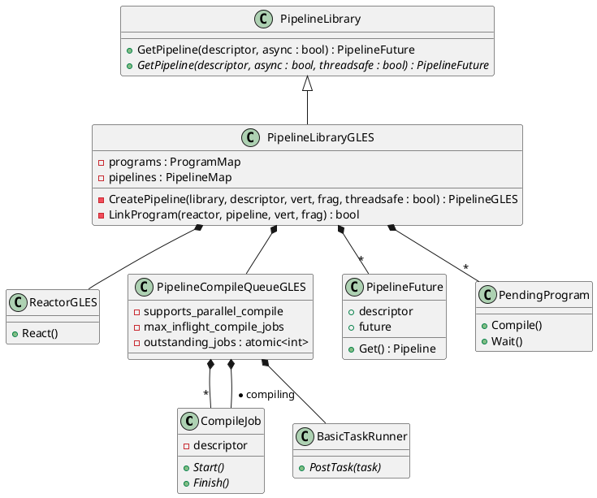
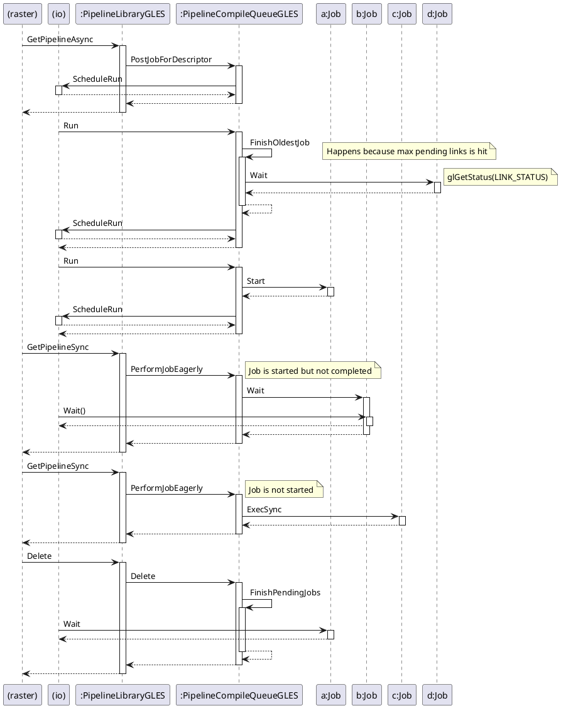

# RFC 210.0000: Parallel OpenGLES Linking in Impeller

## Description

This design doc lays out a refactoring of the pipeline compilation process on
Impeller OpenGLES that allows supporting backends to parallelize shader
compilation which will increase the likelihood that a shader is immediately
availble for use in the first frames of rendering.

## Background

On backends like Vulkan and Metal we are able to precompile shaders at
compile-time. For the OpenGLES backend we need to compile them at runtime. The
API provides a few functions to help make that happen:

- [glCompileShader](https://registry.khronos.org/OpenGL-Refpages/es3.0/html/glCompileShader.xhtml)
- [glLinkProgram](https://registry.khronos.org/OpenGL-Refpages/gl4/html/glLinkProgram.xhtml)
- [GL_LINK_STATUS](https://registry.khronos.org/OpenGL-Refpages/gl4/html/glLinkProgram.xhtml)

The OpenGLES standard doesn't specify exactly when the linking needs to be done,
it just has to be realized before it's actually used. This allows some drivers
to allow parallel compilation jobs to happen at the same time. Currently
Impeller is not taking advantage of this. It is instead serially issuing
compilation jobs and querying the `GL_LINK_STATUS` which forces synchronization
on the compilation job.

In Impeller we work with Pipelines, but from the OpenGLES perspective there are
programs and there are pipelines. A program represents a compiled bundle of
shaders, for example a vertex shader and a fragment shader. A pipeline
represents a variant of those compiled shaders, for example with specialization
constants set. Programs can be shared across pipelines and they have their own
cache.

ANGLE supports parallel compilation, which is what Impeller uses on Windows. On
Android it doesn't seem to be as common. There isn't a direct check for support
but we can infer from the presence of the `KHR_parallel_shader_compile`
extension that some devices do support it.

## Technical Details

The PipelineLibraryGLES design as it stands today is not well suited to handle
parallel compilation jobs. For one thing, the logic for the PipelineLibraryGLES
class is split among 3 different classes: PipelineLibraryGLES,
PipelineCompileQueue, PipelineCompileQueueGLES. This makes it difficult for us
to reason about and make the necessary changes. The following refactors will
first need to be redone:

- Delete PipelineCompileQueue - It's artificially making the Vulkan compile
  queue and the OpenGLES queue behaves similarly for no reason. There is one
  place in the code that grabs the queue from the library and talks to it
  directly to eagerly perform a job. That request should come through the
  library directly.
- Create a class to represent pending programs - This will allow us to maintain
  the concept of a compiling program when it no longer is a synchronous
  operation.

### Class diagram

Here's what things will look like after the refactoring.



### Sequence diagram

This shows how managing jobs will happen with the PipelineCompileQueueGLES and
the io thread.



### Pseudocode

Here is the logic that will happen inside of the queue. It works recursively on
the io thread, doing one operation at a time and allows out of order
synchronization when an eager request happens from the raster thread.

```dart
class PipelineQueue {
  // Raster thread
  void StartJob(Job job) {
    _inactive_jobs.Add(job)
    ScheduleRun()
  }


  // io thread
  void Run() {
    if (_eager_request){
      Job job = _active_jobs.Find(_eager_request)
      _eager_request = null
      if (job) {
        job.Synchronize()
      }
      _condition_variable.Signal()
      ScheduleRun()
    } else if (_active_jobs.count < LIMIT) {
      Job job = _inactive_jobs.Pop()
      job.Start()
      _active_jobs.Add(job)
      ScheduleRun()
    } else {
      Job job = _active_jobs.Pop()
      if (job) {
        job.Synchronize()
        ScheduleRun()
      }
    } 
  }


  // Raster thread
  void RunEager(Desc desc) {
    Job job = _inactive_jobs.Remove(desc)
    if (job) {
      job.Start()
      job.Synchronize()
    } else {
      _eager_request = desc
      ScheduleRun()
      _condition_variable.Wait()
    }
  }
}
```

## Testing

We already have the benefit of many high level integration tests. Since this
change is happening under the covers and at a critical point in rendering that
100% of renders will hit that will provide a lot of coverage.

The new logic, parallel execution, will be exercised in unit tests on
PipelineCompileQueueGLES. The following cases should be be covered:

- Destruction with outstanding pending jobs and active jobs
- Eager execution swaps the priority of synchronization of active jobs
- Hammering the queue enforces a limited number of jobs

## Alternatives considered

### Use the `KHR_parallel_shader_compile` extension

There is an extension that directly deals with parallel compilation of shaders.
It opens up an API that allows one to query the status of a compile job without
blocking. Previous attempts at fixing this problem used that API and guarded
parallel execution on the presence of that extension.

That API is a polling API, there is no callback when compilation is complete. No
good heuristic could be thought up that does polling efficently without some
tradeoffs. It is also possible that a driver supports parallel compilation but
does not support the extension. By implementing the code with the assumption of
parallel compilation, the code is cleaner and we capture more potential benefits
if the drivers support it.
