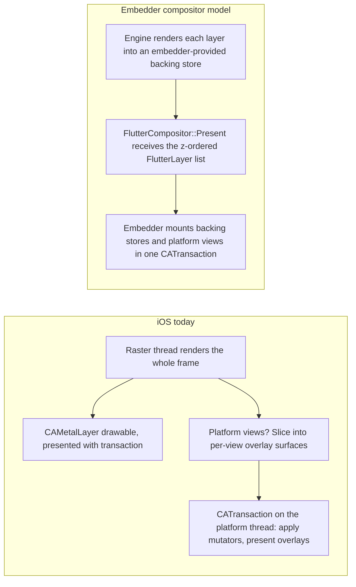
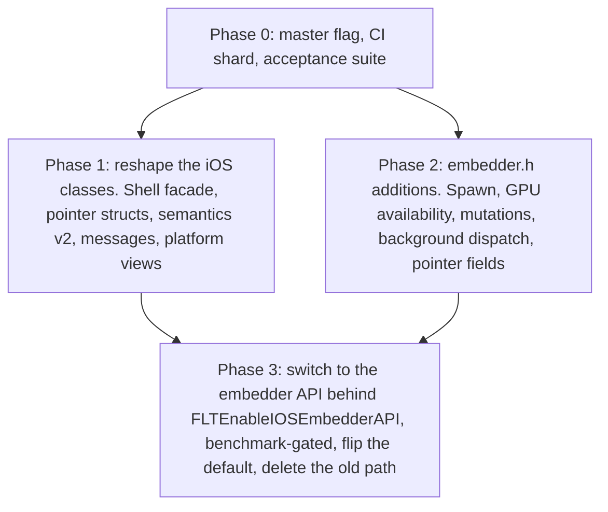

# RFC 410.0000: Migrate the iOS Embedder to the Embedder API

## Overview

The embedder API, defined in [`embedder.h`][embedder.h], is the stable C
interface through which embedders drive the Flutter engine. All recent
embedders, including the desktop embedders, are built on it, but the iOS,
Android, and Fuchsia embedders predate the embedder API and were never moved
onto it, so each links directly against internal C++ engine classes. This RFC
covers the iOS embedder. The Android embedder is the subject of a separate
migration effort, and out of scope in this document.

This RFC proposes migrating the iOS embedder onto the embedder API in a series
of independently landable phases behind a single flag. When the migration is
complete, the iOS embedder will boot the engine through `FlutterEngineRun`,
receive frames as `FlutterLayer` lists through a `FlutterCompositor`, consume
semantics as `FlutterSemanticsUpdate2`, and deliver input as
`FlutterPointerEvent`s. Internal engine connector classes such as
`PlatformViewIOS`, `VsyncWaiterIOS`, `IOSExternalViewEmbedder`, `IOSSurface`,
`IOSContext`, and `PlatformMessageHandlerIos` will be deleted, and `darwin/ios`
will no longer depend on `shell/common`, `flow`, or `lib/ui`.

This RFC is organised such that the migration is implemented in a series of
incremental refactorings and small API additions and strives to minimise the
use of the migration flag. Flagged code is limited to a small amount of
configuration and startup code, and part of the rendering implementation.

* Phase 0 establishes a migration flag and adds tests to prevent regressions.
* Phase 1 reshapes the existing iOS classes into structural equivalents of their
  embedder-API counterparts (an accessibility bridge that consumes
  `FlutterSemanticsUpdate2`, for example) while they continue to link against
  the engine internals.
* Phase 2 lands the additions the embedder API needs before it can support iOS.
* Phase 3 swaps configuration, startup, and rendering over to the embedder API
  behind the flag, flips the default once the benchmarks are acceptable, and
  deletes the old code once we're certain there are no regressions.

This RFC introduces no significant user-visible changes. The tracking issue is
[flutter/flutter#112232][112232].

## Motivation

This work has two main motivating factors.

The first is consistency across embedders. The macOS, Windows, and Linux
embedders are all clients of the embedder API, as is every custom embedder. The
mobile and Fuchsia embedders are the only exceptions. Every internal refactor to
the shell, the layer tree, semantics, or pointer handling has to account for iOS
reaching into those internals. This slows down engine work, since iOS maintains
its own implementations of components that the embedder API already provides, so
bugs end up being fixed twice or the two implementations drift apart.

The second is that the embedder API ought to meet the needs of our own
embedders. If it cannot support the iOS or Android embedders, we cannot
reasonably claim that it can support anyone else's. Moving iOS onto the embedder
API requires filling several gaps in the API, ranging from engine spawning, to
GPU availability, to platform-view mutation types, and every embedder can then
use those additions.

Finally, this refactoring also has several code health and engineering velocity
benefits:

* Any Objective-C header that includes a `std::unique_ptr`, an `fml::RefPtr`, or
  a `flutter::` type forces Objective-C++ onto everything that imports it, which
  prevents direct use from Swift. Swift adoption is therefore blocked in several
  of the components where iOS has the most code.
* Platform-view compositing on iOS is out of sync with macOS: it is implemented
  as an exception path on top of direct-to-drawable rendering, and this has been
  a source of several iOS compositing bugs. Under the compositor model used by
  macOS, platform views are ordinary layers.
* Once the iOS embedding speaks `embedder.h`, it can also be built independently
  of engine internals, which may open up some optimisations in our build and CI.

### Non-goals

This work does not change any public API: `FlutterEngine`,
`FlutterViewController`, `FlutterPlugin`, platform view factories, and the
channel APIs all maintain their existing API contracts.

Similarly, while this work involves refactoring view-related APIs, and we go out
of our way to avoid baking in single-view assumptions as part of that work, this
RFC does not make any progress towards multi-view or multi-window support
in iOS.

Finally, while this RFC involves migrating rendering to compositor APIs, it
adds no new rendering features. The goal is pixel and performance parity with
the current implementation.

## The iOS embedder today

`FlutterEngine.mm` owns a `flutter::Shell`, a `ThreadHost`, and a
`SamplingProfiler`, and creates `PlatformViewIOS`, a subclass of the internal
`flutter::PlatformView`. `PlatformViewIOS` in turn creates the vsync waiter,
the external view embedder, the rendering surface and GPU context, the platform
message handler, and the C++ accessibility bridge. Each of these has an
embedder-API equivalent that is already used in the macOS embedder:

| iOS internal class | Embedder-API equivalent |
| --- | --- |
| `PlatformViewIOS` | `PlatformViewEmbedder` |
| `VsyncWaiterIOS` | `VsyncWaiterEmbedder` + `vsync_callback` |
| `IOSExternalViewEmbedder` | `EmbedderExternalViewEmbedder` |
| `IOSSurface` / `IOSContext` | `EmbedderSurfaceMetalImpeller` |
| `PlatformMessageHandlerIos` | `EmbedderPlatformMessageHandler` |
| direct `ThreadHost` ownership | `EmbedderThreadHost` |

As noted, the macOS embedder's `FlutterEngine.mm` is an ordinary embedder-API
client. Its task runners cross the ABI as `FlutterCustomTaskRunners`, with the
platform and UI threads merged on the main thread and the raster thread managed
by the engine. Rendering is implemented as `FlutterCompositor` callbacks into
`FlutterSurfaceManager`'s IOSurface-backed layers; vsync goes through
`vsync_callback` and `FlutterEngineOnVsync`, semantics through
`update_semantics_callback2`, and messages through `platform_message_callback`.
Platform views are mounted from the `FlutterLayer` list received in
`FlutterCompositor::Present`.

Several refactorings landed in preparation for this migration simplify things:

* The platform and UI threads are always merged, so the iOS thread topology
  already matches macOS and `FlutterCustomTaskRunners`.
* Rendering is Impeller on Metal with no Skia path, so there is a single
  renderer configuration to handle.
* There is a single presentation path: the `FlutterView`'s layer is a
  `CAMetalLayer` with `presentsWithTransaction` enabled. Drawables are presented
  from the main thread, and `VsyncWaiterIOS` holds the Core Animation commit
  until the raster thread has submitted the frame. The Rendering section of this
  RFC depends on this work.

An earlier migration attempt in 2023 left at least one useful piece of
scaffolding behind. `FlutterDartProject` reads an `FLTEnableIOSEmbedderAPI` key
from the `Info.plist` into `settings.enable_embedder_api`, and `FlutterEngine`
populates a `FlutterEngineProcTable` when the flag is set. This migration will
use that flag as its rollout switch.

### Engine internals used by the iOS embedder

The dependencies on engine internals are concentrated in six places.

1. `FlutterEngine.mm` owns the `Shell` (run, spawn, screenshot, the first-frame
   callback, GPU availability, and display updates) and the `ThreadHost`, and
   exposes a `PlatformViewIOS*` accessor that is used throughout the class. It
   builds `PointerDataPacket`, `KeyData`, and `ViewportMetrics`, and consumes
   `Rasterizer::Screenshot`.
2. `FlutterViewController.mm` builds `flutter::PointerData` directly at roughly
   forty sites covering touches, hover, scroll, pinch/rotate gestures, and
   stylus fields, and it calls `PlatformView::HitTest` to decide whether a touch
   beginning over a platform view should be intercepted.
3. `FlutterPlatformViewsController`, the largest by far, consumes
   `EmbeddedViewParams` and `MutatorsStack`, records into `DlCanvas` slices,
   submits `SurfaceFrame`s, and owns an `OverlayLayerPool` of `IOSSurface` and
   `flutter::Surface` pairs.
4. `AccessibilityBridge` consumes `SemanticsNodeUpdates` and
   `CustomAccessibilityActionUpdates`, both internal `lib/ui` types, where
   macOS consumes `FlutterSemanticsUpdate2`.
5. `PlatformMessageHandlerIos` consumes `flutter::PlatformMessage` and
   implements the public `FlutterTaskQueue` background-dispatch feature,
   which the embedder API does not currently support.
6. `VsyncWaiterIOS` adapts the Swift `VSyncClient` and `DisplayLinkManager`
   to the engine's `VsyncWaiter` interface and owns the commit wait/signal.
   `VariableRefreshRateDisplay` reports ProMotion rate changes into
   `Shell::OnDisplayUpdates`.

Two observations about these dependencies drive the work in Phase 1.

The first is that every Objective-C header that names a `std::unique_ptr`,
`std::shared_ptr`, or `fml::RefPtr` forces Objective-C++ on its importers. The
embedder C ABI replaces all of them with opaque handles and explicit create and
destroy calls, so each of the current ownership idioms needs a mapping:

* `fml::RefPtr` maps to a handle plus a release call;
* `fml::WeakPtr` maps to `__weak`, or to `user_data` with a `destruction_callback`;
* `std::unique_ptr` handed across threads maps to the embedder callback
  contract, under which data is valid only for the duration of the call and the
  receiver copies whatever it keeps.

The second is that as part of earlier exploratory work, we already introduced a
precedent for the C++/Obj-C header split we need. The primary header file for
`FlutterFMLTaskRunner` is pure Objective-C; it confines C++ API to an `+FML`
category header. Phase 1 of this RFC will use the same approach.

## Embedder API gaps

Most of what the iOS embedder does is already available through the embedder
API: vsync, display and refresh-rate updates, locales, semantics, Metal external
textures, low-memory notification, custom task runners with a merged platform/UI
thread, wide gamut, and next-frame callbacks. The gaps that remain require
additive changes to `embedder.h`.

Because embedder API changes are permanent, review takes time and we should
begin that work immediately so they can land in parallel with Phase 1.

| Gap | Severity | What iOS needs |
| --- | --- | --- |
| Engine spawning (`FlutterEngineGroup`) | High     | There is no `Shell::Spawn` equivalent. Spawned iOS engines share the Dart VM, the isolate-group snapshot, the GPU context, and the raster/IO thread host. We need a `FlutterEngineSpawn` API that maps to `Shell::Spawn` inside `EmbedderEngine`, with thread-host and renderer-context sharing. This is the most complex of these APIs to add. |
| GPU availability | High     | iOS must stop submitting GPU work when backgrounded or Metal will kill the process. The engine derives GPU availability from the app/scene lifecycle and calls `Shell::SetGpuAvailability`, which has no embedder-API surface. The rasteriser only honours the switch for surfaces whose `AllowsDrawingWhenGpuDisabled()` returns false. The embedder-API surfaces return true, so they also need updating. |
| Platform-view mutations | High | `FlutterPlatformViewMutation` supports opacity, clip rect, clip rounded rect, and transform. iOS also applies clip path, clip rounded superellipse, and backdrop blur (through `UIVisualEffectView`, with a filter region). |
| Background message dispatch | High | The iOS channel classes (`FlutterMethodChannel`, `FlutterBasicMessageChannel`, `FlutterEventChannel`) and `FlutterBinaryMessenger` take a `taskQueue:` parameter that lets a plugin run its handler on a background queue instead of the main queue. The embedder API has no equivalent: `platform_message_callback` is always invoked on the platform thread. We need a mode that skips that trampoline so the iOS embedder can dispatch to the handler's queue directly. |
| Pointer fields | Medium | `FlutterPointerEvent` includes pressure and stylus buttons but not tilt, orientation, or radius major/minor. |
| Platform-view hit test | Medium | `PlatformView::HitTest` has no equivalent, and gesture accept/reject depends on it. Ideally, we should keep the presented geometry of each platform view on the platform embedder side, and answer the query there, with no new API. |
| Screenshot | Low | The `flutter/screenshot` channel uses `Shell::Screenshot`. macOS reads back the presented surface instead. |

## Rendering

This section describes how iOS presents pixels today, how the embedder API's
compositor model differs, and the proposed rendering architecture.

### Direct rendering and the compositor model

On iOS, the engine renders into the view's swapchain. The raster thread
acquires a drawable from the `FlutterView`'s `CAMetalLayer`, draws the whole
frame into it, and presents it. The iOS embedder supplies the layer up front
and never sees the frame again, since presentation happens inside the engine.
Platform views are handled via an exception path in which the frame is sliced
into per-view overlay surfaces, each with its own `IOSSurface`. A
`CATransaction` posted to the platform thread applies mutators to the UIKit
hierarchy. Because every layer presents with the transaction and
`VsyncWaiterIOS` holds off on the commit until the raster thread has submitted,
UIKit views and Flutter pixels are committed simultaneously.

When using the embedder API, the engine produces layers and the embedder is
responsible for compositing them. A frame is a data structure: a z-ordered list
of `FlutterLayer`s, each of which is either a backing store or a platform view.
This is handed across the ABI in `FlutterCompositor::Present`. The engine renders into backing
stores that the embedder supplies via `create_backing_store_callback` but
never touches the screen itself; the embedder decides how to mount those layers.
Platform views are layers with a distinct type in the same list.

The embedder API assumes the second model. That migration is covered in Phase 3
of this RFC.

### Proposed rendering architecture

The most direct translation of the macOS model would be to port
`FlutterSurfaceManager` to iOS: pooled IOSurfaces set as `CALayer.contents`,
one per layer, with the embedder scheduling presentation itself. iOS has
shipped a similar mechanism before, as `FlutterMetalLayer`, but removed it
because it re-presented stale frames and added a frame of latency
([#189373][189373]). It's likely that the macOS embedder will also move to
`CAMetalLayer`-based presentation in the future. A full-screen opaque
`CAMetalLayer` also happens to be eligible for direct-to-display scanout, which
Core Animation does not do with a composited IOSurface layer. This saves memory
bandwidth, and reduces latency and power use. This RFC therefore proposes
keeping the `CAMetalLayer` drawable as the root of the frame and building the
compositor around that.

The embedder API has two rendering modes:

* Without a compositor, the engine renders each frame into a drawable obtained
  through `FlutterMetalRendererConfig`'s `get_next_drawable_callback` and
  presents it through `present_drawable_callback`.
* With a `FlutterCompositor` installed, the engine instead renders each layer
  into a backing store obtained through `create_backing_store_callback`, which
  for Metal is a texture the embedder owns, and hands the resulting layer list
  to the embedder to composite.

There is currently no mode in which the root is a drawable and only the overlays
go through the compositor.

The proposal is to install a compositor and return drawable textures as backing
stores. When the engine requests the root layer's backing store, the embedder
returns the texture of the `FlutterView` layer's next drawable; for overlay
layers, it returns textures from `FlutterOverlayView` drawables, just as we do
today. The present callback presents those drawables while the Core Animation
commit is waiting, so that they commit in the same transaction as the platform
view mutations. Because a drawable is valid for one frame only, the compositor
sets `avoid_backing_store_cache` so that the engine requests a fresh backing
store every frame instead of reusing one.

It is still an open question whether the engine's backing-store lifecycle can
handle a store that is valid for a single frame. If this approach works, Phase 3
will retain the current pixel path and add only the layer-list interface on top
of it. If not, the fallback is to update `embedder.h` to support a
drawable-style root alongside a compositor.

In either case, the embedder backend must preserve the current commit wait.
Presentation must complete, or the wait must be released, before the main thread
returns from `layoutSubviews`. That logic will move out of `VsyncWaiterIOS`,
which will be deleted, and into `VSyncClient`.

## Platform views

This section describes `FlutterPlatformViewsController`, how its
responsibilities are split between the parts remaining after this migration and
the parts that will be deleted, as well as the data model that replaces
`MutatorsStack` at the boundary between the two.

### Current state of `FlutterPlatformViewsController`

`FlutterPlatformViewsController` is about 1,100 lines of Objective-C++. The
class currently does three jobs:

* It is the `flutter/platform_views` channel endpoint.
* It is the backend to which `IOSExternalViewEmbedder` forwards every
  `ExternalViewEmbedder` virtual call on the raster thread. It slices the frame,
  diffs composition parameters, allocates overlays, and cuts underlay holes.
* It is the UIKit compositor that applies mutators, clip masks, and blurs
  inside a single `CATransaction` on the platform thread.

Much of its complexity comes from marshalling state between the platform thread
and the raster thread, and a good share of its bugs has historiically arisen
from that code.

The macOS `FlutterPlatformViewController` serves the same purpose but avoids all
the compositing overhead, which is handled by the compositor. The remaining
platform-view specific code is about 180 lines of channel dispatch, factory
registry, and view storage. The proposal is for iOS to end up with the same
division.

### What happens to each of the controller's responsibilities

As part of this migration, each of the controller's responsibilities either
survives, is replaced, or is deleted.

| Responsibility | End state |
| --- | --- |
| Channel handling, factory registry, view storage, gesture forwarding | Survives unchanged. These are embedder-side in both worlds. The registry will additionally record each view's geometry to support hit-testing. |
| Mutator application, clip masks, blur, z-ordering (platform thread) | Survives, and becomes the platform-view half of `FlutterCompositor::Present`. |
| Cross-thread handoff (the submit snapshot) | Replaced by an equivalent handoff driven by the present callback. |
| Frame lifecycle, param diffing, slice recording, underlay cutouts, submit orchestration (raster thread) | Deleted. `EmbedderExternalViewEmbedder` performs this work in the engine. |
| Overlay layer pool | Replaced by the Phase 3 compositor. |

The platform-thread half of the class will continue to exist after this
migration, so this work should make it easier for later refactorings to clean
up that code and bring it closer to the macOS structure over time. The
raster-thread half will be deleted, so it should be left in its current Obj-C++
state and receive only mechanical changes in the meantime.

### The mutation and layer model

The raster half's output needs to be restructured into a layer list that mirrors
the embedder API's `FlutterLayer` and `FlutterPlatformViewMutation`, so that the
platform-thread compositor stops consuming `MutatorsStack`. This model should
mirror the embedder API rather than being designed for Objective-C or Swift
ergonomics.

Proposed approach for this model:

* inherit the C API's semantics: an ordered mutation list applied in
  sequence, transforms not pre-divided by the device pixel ratio, and
  per-corner radii;
* add the additional platform view mutation types that iOS needs that are
  currently lacking in `embedder.h` (clip path, clip rounded superellipse, and
  backdrop blur with its filter rect), written as C structs, because they form
  the draft of the Phase 2 embedder API additions;
* implement the layer-list structure, with content and platform-view entries
  interleaved in z-order;
* require that inputs be valid only for the duration of the call; the receiver
  copies anything it needs to keep.

With this model in place, switching platform views to the embedder API will be
a matter of replacing the converter from `MutatorsStack` with a decoder from
`FlutterPlatformViewMutation[]`. The mutator application, channel handling,
factory registry, and their tests will not change.

### Features to reimplement in the engine

Several features currently exist only in the iOS embedder. Each must be
reimplemented in the engine to preserve existing behaviour.

* **Backdrop filters over platform views:** A backdrop blur above a platform
  view cannot be rendered by the engine, since the platform view's pixels are
  not in the engine's surface, so the layer tree delegates this to the embedder.
  As the raster thread paints the tree, each `PlatformViewLayer` calls
  `PushVisitedPlatformView` and each `BackdropFilterLayer` above it calls
  `PushFilterToVisitedPlatformViews`. `IOSExternalViewEmbedder` currently
  implements both: it records the visited views and attaches the filter and its
  rect to each one, and when the frame is presented the controller wraps each
  affected view in a `UIVisualEffectView` blur. `EmbedderExternalViewEmbedder`
  implements neither of these, so on the embedder path the filter is dropped and
  the native view is presented unblurred. We will need to implement both calls
  in `EmbedderExternalViewEmbedder`, attaching the filter to the platform view's
  `EmbeddedViewParams` such that it reaches the embedder as a
  `FlutterPlatformViewMutation` of the backdrop-blur type introduced in Phase 2.
* **Clip shapes on blurs over platform views:** Each clip layer that encloses a
  platform view (`ClipRectLayer`, `ClipRRectLayer`, `ClipRSuperellipseLayer`,
  and `ClipPathLayer`) calls the matching `PushClip…ToVisitedPlatformViews`
  after painting its children, so that the embedder knows the shape the platform
  view was clipped to. `IOSExternalViewEmbedder` implements all four calls and
  records the shapes on the view's params as backdrop clips, and the controller
  uses them to round the corners of the `UIVisualEffectView` blur so that a blur
  over a `ClipRRect`-wrapped platform view has the same shape as the view. (Path
  clips are not yet handled; see [#179127][179127].)
  `EmbedderExternalViewEmbedder` implements none of these, so a blur on the
  embedder path would be rectangular. The engine must implement these callbacks
  in `EmbedderExternalViewEmbedder`, record the shapes on the view's params, and
  include them in the backdrop-blur mutation introduced in Phase 2.
* **Atomic presentation of Flutter content and platform views:** When a frame
  contains platform views, the controller's `submitFrame:` runs on the raster
  thread, snapshots the frame's state, and posts it to the platform thread,
  where `performSubmit:` does the rest inside a single `CATransaction`: it
  updates the overlay views, disposes removed platform views, applies the
  mutators to each native view, presents the root and overlay drawables, and
  reorders the subviews to match paint order. Because every layer has
  `presentsWithTransaction` set and `VsyncWaiterIOS` holds off the Core
  Animation commit until the frame has been submitted, the Flutter pixels, the
  overlay layers, and the native view changes all occur in the same commit.
  Without that, a frame in which a platform view moves would show the native
  view and the Flutter content around it out of step for a frame. With the
  embedder API, the engine calls the compositor's present callback on the raster
  thread with the layer list. It does not open a transaction, so the iOS
  compositor must do what `performSubmit:` does today, on the platform thread:

  * post the layer list from the present callback to the platform thread;
  * open a `CATransaction`;
  * apply the mutations in the layer list to the native views;
  * present the root and overlay drawables;
  * reorder the subviews to match paint order;
  * commit, before the commit wait is released.

  The engine must not collect the frame's backing stores until the transaction
  has been committed. Whether its current collection timing allows for this is
  one of the questions that needs to be answered by the rendering prototype in
  Phase 3.

## Implementation plan

This section describes each phase of the migration and the dependencies between
them.

Phases 1 and 2 can run in parallel. The rendering prototype described above can
begin at any point, and must be complete before the compositor step of Phase 3.

### Phase 0: groundwork

This phase is cleanup and pre-work to get the iOS embedder into shape for
migration. The bulk of this phase has already been landed.

* The master migration flag was wired up and documented.
* The embedder tests were audited for testing gaps related to changed code, and
  tests were added to prevent regressions in later phases.
* `FlutterEngine` now populates its `FlutterEngineProcTable` when the embedder
  API enablement flag is set.
* Tests were added covering:

  * platform-view mutation goldens including rounded superellipse clips.
  * background-GPU lifecycle.
  * `FlutterTaskQueue` background-channel tests.
  * `FlutterEngineGroup` sharing semantics.
  * stylus fidelity tests.

The remaining work is a CI shard that runs the iOS unit and scenario tests with
the flag enabled, and an audit of accessibility test coverage, which Phase 1.3
depends on.

### Phase 1: reshape the iOS classes

Phase 1 consists of refactoring with no behaviour change. When it is complete,
internal C++ types will no longer appear in the Objective-C interfaces, although
everything will still link against engine internals. Each iOS component will
instead take its input in the form of the corresponding embedder API struct,
such as `FlutterSemanticsUpdate2` for the accessibility bridge, so that in
Phase 3 the embedder API's callbacks can call into these components directly.

#### 1.1 Shell facade

`FlutterEngine.mm` currently calls into the `Shell` and `PlatformViewIOS`
directly at dozens of sites, covering run, spawn, screenshot, the first-frame
callback, GPU availability, display updates, viewport metrics, pointer dispatch,
semantics, textures, messages, and hit testing. Each of these will be migrated
to engine proc table calls later in the migration. This moves them all to one
place with an Objective-C interface to prevent engine-internal C++ types from
leaking into the embedder.

This step will migrate every `Shell` and `PlatformViewIOS` reference in
`FlutterEngine.mm` behind one internal class, `FlutterShell`, held as
`-[FlutterEngine backend]`. This will happen in two stages. First, a short
sequence of commits will move the thread host, task-runner wrappers, shell
ownership, and spawn path into the new class unchanged. Further commits will
then replace those C++-typed entry points, one at a time, with methods that
take and return only Objective-C or plain-C types (e.g. `NSData` in place of
`fml::Mapping`, and a struct mirroring `FlutterWindowMetricsEvent` in place of
`ViewportMetrics`) until `FlutterEngine.mm` no longer includes any
`shell/common` headers.

macOS, Windows, and Linux have no equivalent class because they were built on
the embedder API from the start. `FlutterShell` is scaffolding: it will exist
only for the duration of the migration and will be deleted at the end.

#### 1.2 Input event conversion

`FlutterViewController` will continue to build pointer events but will convert
them immediately to a plain struct that mirrors the embedder API's
`FlutterPointerEvent`, extended with the fields iOS needs that the API still
lacks (tilt, orientation, and radius major/minor). In Phase 2 of the migration,
we'll update the embedder API's structs to support the additional data needed.
The stylus tests added in Phase 0 already cover this conversion.

Touch interception for platform views currently has no embedder API equivalent.
When a touch begins over a platform view, `FlutterTouchInterceptingView` asks
the view controller whether the platform view should receive it, and the engine
answers by hit-testing the UI-thread layer tree through `PlatformView::HitTest`.
That call will move behind the `FlutterShell` facade like the others. In
addition, the platform-views registry will begin recording where each platform
view was presented and what Flutter content covered it, so that the iOS embedder
can eventually answer the question itself.

Note that key events already mirror `FlutterKeyEvent`, so no work is required
for them in this phase.

#### 1.3 Semantics

We will change `PlatformViewIOS::UpdateSemantics` to convert
`SemanticsNodeUpdates` into `FlutterSemanticsUpdate2`, reusing the converter in
`embedder_semantics_update.cc`, and update `AccessibilityBridge` and
`SemanticsObject` ingestion to use that struct. The bulk of this work is
conversion of string attributes, custom actions, scroll semantics, and the tree
diffing in `GetOrCreateObject`. To preserve existing behaviour, both paths will
coexist until the new one is verified:

* Add a second `UpdateSemantics` method to `AccessibilityBridge` that builds
  and diffs the `SemanticsObject` tree from a `FlutterSemanticsUpdate2`,
  alongside the existing one that takes `SemanticsNodeUpdates`.
* Add parity tests that feed identical updates through both paths and assert
  identical `SemanticsObject` state.
* Once all tests pass and a manual VoiceOver pass has been done, delete the
  previous `UpdateSemantics` implementation.

#### 1.4 Platform messages

The iOS embedder implements platform channels in `PlatformMessageHandlerIos`.
Plugins register a handler for a channel through `FlutterBinaryMessenger` or one
of the channel classes.

On iOS, unlike on the embedder API, those registration methods take a
`taskQueue:` parameter: a plugin can obtain a `FlutterTaskQueue` from
`makeBackgroundTaskQueue` and pass it so that its handler runs on that
background queue instead of the main queue. This is public API, so third-party
plugins may depend on it, although no engine channel and no first-party iOS
plugin currently uses it. When Dart sends a message, the engine calls
`HandlePlatformMessage` with a `flutter::PlatformMessage`, which includes the
channel name, the payload as an `fml::Mapping`, and a `PlatformMessageResponse`
through which the reply is completed. The handler looks up the channel, converts
the payload to `NSData`, and dispatches the registered block to its task queue,
or to the main queue if it has none. The reply block completes the response from
whatever thread the handler replies on.

The embedder API delivers messages through `platform_message_callback` as a
`FlutterPlatformMessage`, which includes the channel name, the payload bytes,
and a response handle that the embedder completes with
`FlutterEngineSendPlatformMessageResponse`. It has no notion of a task queue.
The engine-side `EmbedderPlatformMessageHandler` posts every message to the
platform thread and invokes `platform_message_callback` there. The iOS embedder
could still forward a message from that callback to the handler's background
queue, but that would require a full turn of the main run loop, waiting behind
whatever else the main thread is doing.

To keep the `taskQueue:` contract, the embedder API needs the background
dispatch addition listed in the gaps table. `PlatformMessageHandlerIos`'s
dispatch logic needs to stick around until then.

This step will change the handler's internal interface so that it takes a
channel name, an `NSData` payload, and a single-use reply token, with the
`flutter::PlatformMessage` unwrapped once at the entry point. The handler
registry and the task-queue dispatch will not change.

After this change, the handler's interface will include the same contents as a
`FlutterPlatformMessage`: a channel name, a payload, and a response handle,
which will allow us to wire up `platform_message_callback` directly in Phase 3.

#### 1.5 Platform views

This step will introduce the mutation and layer model described under Platform
views and split the class along it:

* Define the boundary model with a tested converter from `MutatorsStack` to a
  mutation list.
* Rewrite the platform-thread mutator application to consume it. This must be
  pixel-neutral and is gated by the goldens.
* Restructure `submitFrame:` so that the platform-thread work is invoked
  through a single present call taking a layer list, with the receiver copying
  its inputs.
* Split the class into the platform-thread presenter and the raster-thread
  coordinator.

This refactoring only changes how the data is represented; there are no semantic
changes, and we padded out the golden tests to cover gaps in Phase 0.

### Phase 2: embedder.h additions

Each of these will be a separate, backwards-compatible addition to
`shell/platform/embedder`. Roughly in priority order:

1. **`FlutterEngineSpawn`:** This likely requires its own smaller design document.
   This can be implemented in three main steps:

   1. Internal refactoring: make `EmbedderThreadHost` shareable between engines
      and expose `Shell::Spawn` through `EmbedderEngine`.
   2. Public API: spawn from an existing engine with a reduced args struct,
      returning a new handle that shares the VM, the snapshot, and the thread
      host, with shutdown-ordering tests.
   3. Renderer-context sharing: reuse the source engine's Impeller context in
      the spawned engine's Metal renderer. Today, iOS passes the parent's
      `IOSContext` into the spawned engine's platform view, so both engines
      render through one Impeller context and share its shader library and
      pipeline cache. In the embedder API, every engine's
      `EmbedderSurfaceMetalImpeller` creates its own context from the device
      in `FlutterMetalRendererConfig`.
2. **GPU availability:** `FlutterEngineSetGpuAvailability`, mapping to
   `Shell::SetGpuAvailability`. This can be implemented in three steps:

   1. Override `AllowsDrawingWhenGpuDisabled()` to return false in the
      embedder-API GPU surfaces. `Rasterizer::DrawToSurfaces` checks the switch
      only for surfaces that return false, and the base `Surface` and
      `GPUSurface*Delegate` implementations return true. The dropped frame is
      not queued; the lifecycle `resumed` message already schedules a new one.
   2. Pass the shell's switch to the Impeller context. `EmbedderSurfaceMetalImpeller`
      currently constructs `ContextMTL` with its own `SyncSwitch`, so the
      context's command-buffer drain never runs. The platform-view factories in
      `embedder.cc` receive the `Shell`, so the switch is available at
      construction time. `ContextGLES` and `ContextVK` take no switch; adding one
      is not needed for iOS but gives embedded Linux embedders the same
      behaviour.
   3. Public API: an enum with the three shell values rather than a boolean.
      `kFlushAndMakeUnavailable` blocks the platform thread while the IO thread
      drains its unref queue, which is right when the app is about to background
      and wrong once the GPU is already gone.

   Tests will assert that no frame is drawn and the next-frame callback does not
   fire while unavailable, that rendering resumes on re-enable, that the flushing
   variant returns only after the IO runner has drained, and that the Impeller
   context observes the shell's switch. The call is platform-thread only and
   does not free any memory (`FlutterEngineNotifyLowMemoryWarning` does that).
3. **Mutation types:** clip path (the boundary model will settle whether this is
   serialised path commands or an opaque path handle), rounded superellipse
   mirroring `FlutterRoundedRect`, and backdrop blur with sigma and filter
   rect. These will be emitted from `MutatorsStack` in `embedder_layers.cc`,
   together with the visited-view callbacks described above, which are needed
   for the mutations to reach the embedder at all.
4. **Background message dispatch:** an opt-in that lets
   `platform_message_callback` be invoked on the sending thread instead of the
   platform thread, so that the iOS dispatcher can route a message to the
   handler's `taskQueue:` directly. This preserves the iOS channel classes'
   `taskQueue:` parameter, which the embedder API has no equivalent for. The
   thread-safety contract for response handles will be documented and tested.
5. **Pointer fields:** tilt, orientation, and radius major/minor appended to
   `FlutterPointerEvent`, gated on struct size.
6. **Hit testing:** contingent on the platform-side geometry answer proving
   insufficient for clipped or obscured views.
7. **Drawable-root presentation:** contingent on the rendering prototype in
   Phase 3.

### Phase 3: switch to the embedder API

Everything in this phase will happen behind `FLTEnableIOSEmbedderAPI` until
the default flips. Because of Phases 1 and 2, most steps wire together pieces
that already exist. The exception is rendering, which changes models in this
phase and is described separately below.

#### Building the embedder backend

We will extract a `FlutterEngineBackend` protocol from the `FlutterShell` class
introduced in Phase 1.1, with two implementations: the shell-backed
`FlutterShell` and a new `FlutterEmbedderEngine`. At initialisation time,
`FlutterEngine` will select one of the two based on the flag, and store it in
its existing `backend` property. No call sites change in the embedder.
`FlutterEmbedderEngine` will then need to wire up each of the following
features against the embedder API:

* headless boot with `FlutterProjectArgs` and custom task runners on
  `FlutterRunLoop`;
* platform messages;
* the renderer configuration in drawable mode, without a compositor;
* vsync and displays;
* input;
* semantics;
* the compositor;
* platform views, through a thin decoder into the same presenter the flag-off
  path uses;
* external textures, with the `CVPixelBuffer` adapter ported from macOS;
* lifecycle extras;
* `FlutterEngineGroup` over `FlutterEngineSpawn`.

At this point, the iOS embedder components refactored in Phase 1 (the
accessibility bridge, platform message handler, platform-view presenter, and
`VSyncClient`) have been structured to be easily driven by either
implementation. Other than the compositor, each item above is primarily wiring
and glue code.

#### Moving rendering to the compositor

Rendering will move to the embedder API in two steps, so that the API switch
and the change of rendering model can be benchmarked separately.

In the first step, the renderer will be configured in drawable mode with no
compositor (and therefore no platform views): `get_next_drawable_callback` will
return the `FlutterView` layer's next drawable and `present_drawable_callback`
will present it inside the commit wait. Pixels and presentation will match the
flag-off path, so a benchmark of this step against
the flag-off path can measure the cost of the API switch independent of the
compositor migration.

In the second step, once the prototype has shown that the engine's
backing-store lifecycle tolerates a single-frame store, the compositor described
under Rendering will be installed. This will proceed as follows:

* The root layer will render through the compositor, as a single layer with no
  platform views.
* Damage and partial repaint will be brought to parity with the drawable-mode
  step.
* Platform views will move to the compositor. Overlay slices will render into
  further drawables, and the Phase 1.5 presenter will mount native views
  between them in a single `CATransaction`.

If the prototype fails, the same steps will run on top of the drawable-root API
extension from Phase 2 instead. We can then benchmark the second step against
the first to measure the effect of the compositor.

Benchmarking should be run on both low-end and ProMotion hardware, measuring
frame times, memory, startup, and CPU.

The logic in `VsyncWaiterIOS` that fires the first vsync before the commit,
waits for content, and handles `FrameSubmitted` will move to `VSyncClient`
before the C++ adapter is deleted.

#### Running both configurations and rolling out

Once any fixes are landed and performance is verified to be acceptable, we can
flip the flag default, preserving the opt-out.

At this point we can run everything in either configuration. CI testing shards
should be created for both configurations for the duration of the roll-out.
Rollout will proceed from opt-in, to default-on in beta with the plist key
inverted to an opt-out, to deletion after a stable release. Until the deletions
land, the flag flip can be reverted at any point by changing the flag.

#### Deleting the old path

The deletions are:

* the shell-backed backend;
* `PlatformViewIOS`, `VsyncWaiterIOS`, and `IOSExternalViewEmbedder`;
* `IOSSurface`, `IOSContext`, the legacy rendering path, and the overlay pool;
* the internal-type entry points of `PlatformMessageHandlerIos`.

The final commit will remove `shell/common`, `flow`, and `lib/ui` from
`darwin/ios/BUILD.gn` and add a build-level check that `darwin/ios` links only
against the embedder target and shared Darwin code, so that the build enforces
the separation from then on.

#### Keeping the `FlutterEngineBackend` protocol

It is useful to keep the `FlutterEngineBackend` protocol even though only one
implementation will remain, because it is the interface through which we can
later share code with macOS. Of the procs the macOS embedder calls, almost all
are operations iOS needs with identical semantics.

So that the code can later be moved without being redesigned, the following
constraints will apply from the first commit of the Phase 1.1 facade:

* The concrete backend keeps its proc table exposed, as macOS does, so that
  per-proc mocking continues to work.
* Protocol members are named and shaped after the procs they call, and are
  parameterised by view ID like the macOS multi-view API.

## Alternatives considered

This section covers the alternatives considered and the reasons they were not
chosen.

### Keep the status quo

The costs described under Motivation grow over time. In particular, Swift
adoption in the iOS embedder is blocked on the same components this RFC
proposes to change.

### Migrate to `PlatformViewEmbedder` first, then to `embedder.h`

An earlier version of this plan had an intermediate step in which iOS stopped
subclassing `PlatformView` and instead populated the `PlatformViewEmbedder`
dispatch table with Objective-C blocks. It was dropped because
`PlatformViewEmbedder` is an internal class driven by `embedder.cc`, so the
intermediate state is neither stable nor much smaller, and we would still need
to fill every gap in `embedder.h` to get past it. Going straight to the C API
through a facade provides the same result faster.

### Port the macOS IOSurface surface manager to iOS

This is the fallback should the drawable-root compositor prove unworkable. It is
not the default plan because iOS's previous IOSurface-backed presentation layer,
`FlutterMetalLayer`, was removed because it had issues re-presenting stale
frames and adding a frame of latency. We'd also give up direct-to-display
scanout provided via `CAMetalLayer`.

### Converge rendering on the shell-backed path between Phase 1 and 2

An earlier version of this plan moved rendering to a compositor-shaped path
while iOS still ran on the shell, behind a second flag, so that the rendering
change could reach stable before the API switch. That approach made more sense
when we were sticking with `FlutterMetalLayer` and therefore porting to an
`IOSurface` surface manager, which is a different pixel path.

With a drawable-root compositor, the pixel path does not change, and the
embedder API's drawable mode already provides a step that isolates the API
switch from the rendering change. A shell-backed compositor path would need its
own adapter from `PlatformViewIOS` to `EmbedderExternalViewEmbedder`, a second
flag, and a third CI configuration (shell, shell plus compositor, and embedder
API), all of which would be deleted at the end.
The cost of the chosen approach is that rendering cannot reach stable until
the master flag can flip.

## Risks

Ranked by expected severity:

1. **Rendering:** The compositor step in Phase 3 changes how the root layer is
   rendered and presented, which can regress performance, battery, frame pacing,
   and wide gamut. We will reduce this risk by landing rendering in two steps
   behind the flag, drawable mode first and then the compositor, and
   benchmarking each step against the one before it. The drawable-root prototype
   will be built and verified before the compositor step, and the API-extension
   fallback is still an option if that fails.
2. **The spawn API:** `FlutterEngineSpawn` is the most complex of the Phase 2
   additions. `FlutterEngineGroup` depends on it, so the default cannot flip
   until it has landed. This work is planned to start early in the migration, so
   the internal groundwork will be prototyped before the public API is added.
   Context sharing will land last.
3. **Platform-view mutation parity:** Backdrop blur and clip paths on platform
   views are user-visible, widely-used features, and they rely on the
   engine-side work described under Platform views to land. The goldens from
   Phase 0 verify current behaviour, and the Phase 1.5 boundary model can serve
   as the draft of the Phase 2 mutation types, which reduces the risk of the iOS
   model and the C API drifting apart.
4. **The accessibility rewrite:** Automated coverage of the accessibility bridge
   is relatively weak, so preserving behaviour for users of assistive technology
   depends on manual testing. Phase 1.3 adds parity tests that test identical
   updates through both paths, and we will do manual VoiceOver testing after the
   rewrite and again after the Phase 3 wiring.
5. **Background GPU work:** If GPU work is submitted while the app is in the
   background, Metal kills the process. The lifecycle tests added in Phase 0
   check that the shell's switch is set and will run in both configurations.
   The Phase 2 embedder tests check that no frame is drawn while the switch is
   set, and must land before the flag-on lifecycle wiring in Phase 3.
6. **Pointer fidelity:** Benchmarks do not detect regressions in user perception
   of scrolling as we've seen in recent frame latency issues. The stylus
   fidelity tests added in Phase 0 cover the field conversion, and dogfooding
   during the beta soak will cover the rest.

## Open questions

1. How should a clip path be represented in the C API: as serialised path
   commands, or as an opaque path handle? The boundary-model design in Phase
   1.5 will settle this, since the internal model and the C API must agree.
2. Can `create_backing_store_callback` hand out a transient `CAMetalDrawable`
   texture without the engine's backing-store lifecycle interfering, and can
   collection of the frame's backing stores be deferred until the
   `CATransaction` has committed? The rendering prototype in Phase 3 should
   answer both of these questions.
3. Is the presented-geometry bookkeeping added to the platform-view registry in
   Phase 1.2 enough to handle touch interception for clipped or obscured
   platform views? Phase 1.2 will validate this against `PlatformView::HitTest`.
   If not, the hit-test addition described in Phase 2 will be necessary.
4. What thresholds should rendering benchmarks enforce? This RFC proposes no
   statistically significant regression in p90 build and raster times or in
   memory on low-end hardware without platform views, and an explicit budget for
   the multi-layer case.
5. Should the background-dispatch opt-in in Phase 2 apply to the whole engine
   or to individual messages, and what thread-safety contract should response
   handles have when `platform_message_callback` is run on a thread other than
   the platform thread?
6. Where should plugin message handlers, external textures, and platform-view
   factories live once they are behind the proc table? Today they live in
   shell-owned objects and are discarded with it, while the engine-side
   bookkeeping survives ([#115157][115157], [#126671][126671]). Phase 3 will
   have to decide this before `FlutterEngineGroup` moves to
   `FlutterEngineSpawn`.

[embedder.h]: https://github.com/flutter/flutter/blob/master/engine/src/flutter/shell/platform/embedder/embedder.h
[112232]: https://github.com/flutter/flutter/issues/112232
[115157]: https://github.com/flutter/flutter/issues/115157
[126671]: https://github.com/flutter/flutter/issues/126671
[179127]: https://github.com/flutter/flutter/issues/179127
[189373]: https://github.com/flutter/flutter/issues/189373
