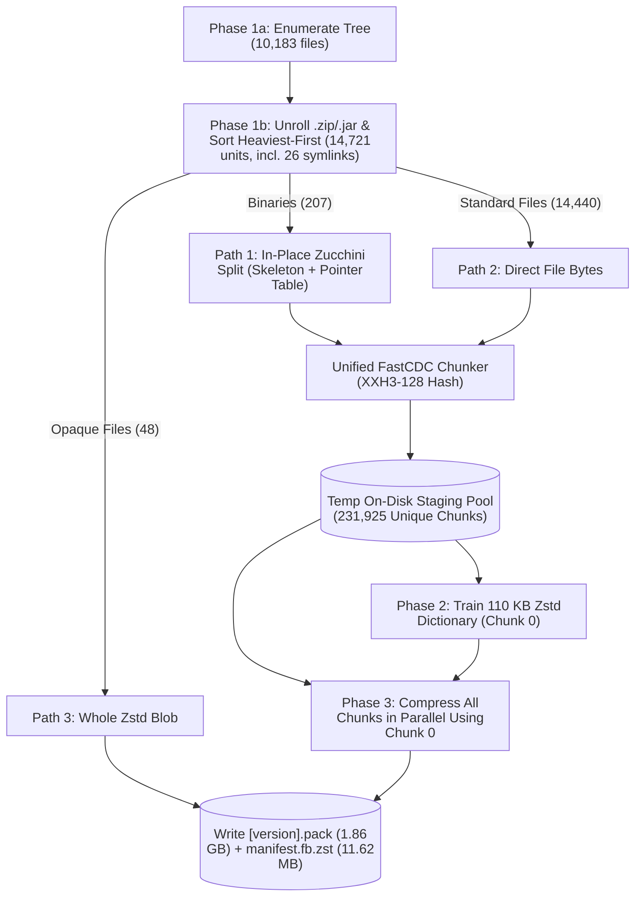
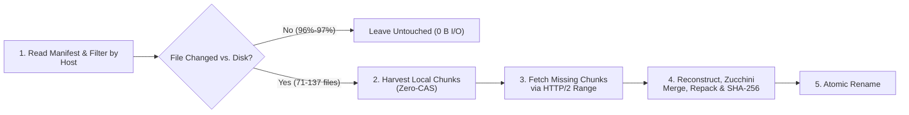

# RFC 610.0000: Pachunk: Content-Addressed Packing & In-Place Delta Patching

## 1. Objective

Reduce the Flutter SDK install size and update downloads.

Today, installing or updating Flutter is like replacing an entire multi-volume encyclopedia every time a few pages change. A fresh Flutter install unpacks **2.5 GB on Linux**, **3.3 GB on Windows**, and **4.1–6.2 GB on macOS**; cloning the repository directly downloads **~470 MB of `.git` history** before a single engine binary is fetched. When a point release ships (`3.47.4` $\to$ `3.47.5`), `flutter_tools` invalidates all of `bin/cache/` and re-downloads **584 MB to 1.57 GB** of `.zip` files even when 95%+ of the compiled code is unchanged.

This RFC proposes **`pachunk`** (from *"patch + chunk"*), an in-place content-addressed installer and updater for Flutter:

1. Chunk files with FastCDC so insertions or deletions only affect local chunks.
2. Normalize compiled binaries with `zucchini` (`zucchini split` / `zucchini merge`) so shifted memory addresses don't scramble every chunk after a recompile.
3. Unroll `.zip` and `.jar` archives so inner binaries (`libflutter.so`, `classes.dex`) are normalized and deduplicated individually, then deterministically repacked on the client.
4. Host each release from a single static `<version>.pack` file on GCS/CDN for serverless delivery over HTTP/2 `Range` requests.
5. Update in place (Zero-CAS) using the local files in `~/flutter` as the chunk cache instead of maintaining a duplicate object store on disk, and verify every reconstructed file against its authoritative `SHA-256` digest.

### Critical User Journeys (CUJs)

* ***As an application developer installing Flutter***, I should only download the toolchains and target platforms I actually build for, without carrying `~300–470 MB` of `.git` history or `~1.5 GB` of engine debug symbols on disk.
* ***As an application developer upgrading or downgrading Flutter***, I should be able to move forward (`3.47.4` $\to$ `3.47.5`) or backward (`3.47.5` $\to$ `3.47.2`) in seconds by downloading only the changed chunks, without wrapper CLIs (`fvm`) or duplicate multi-gigabyte SDK folders.
* ***As a contributor to the Flutter Framework or Engine***, I should be able to switch branches or run `git bisect` across `content_aware_hash` boundaries and sync `bin/cache/` in seconds (`pachunk upgrade --cache-only`) without touching my `.git` history, modifying tracked source files, or exhausting disk space across multiple checkouts.
* ***As a release/infra engineer***, I should be able to publish a single static `<version>.pack` artifact per build to GCS/CDN without precomputing an $N \times M$ matrix of pairwise patches.

### 1.1 Goals

* Minimize network bandwidth: cut fresh install downloads by **>50%** and point-release upgrades by **~90%**.
* Minimize local storage space: cut installed disk footprint by **55%–67%** with zero extra local CAS cache overhead on disk.
* Minimize time to update in any direction ($V_X \leftrightarrow V_Y$): support arbitrary upgrades, downgrades, channel switches, and contributor `git bisect` runs in **13–24 seconds** without precomputing an $N \times M$ patch matrix on the server.
* Operate from static storage with zero server compute: serve all installs and delta updates from static GCS buckets and CDN edges using HTTP/2 `Range` requests against a single `<version>.pack` file per release.
* Guarantee 100% bit-exact `SHA-256` verification: verify every reconstructed binary, file, and reassembled `.zip`/`.jar` archive against its release `SHA-256` digest before atomic replacement on disk, and never touch tracked source files in contributor `--cache-only` mode.

### 1.2 Non-Goals

* `pachunk` is not a package manager: it distributes SDK directory trees and binary artifacts, and does not replace `pub` or system package managers (`apt`, `brew`, `winget`).
* `pachunk` does not replace Git in contributor workflows: removing `.git` applies only to consumer SDK installs. Flutter contributors continue using `git` for version control and code submission.

---

## 2. Background

### 2.1 Current SDK Distribution: Disk and Network Costs

Flutter distributes SDK releases and engine artifacts through full-history `git` clones and monolithic archives (`.zip` and `.tar.xz`) on GCS. A fresh release archive unpacks at least **2.5 GB on Linux** (`1.5 GB` archive), **3.3 GB on Windows** (`1.9 GB` archive), and **4.1 GB on macOS ARM64** (`2.2 GB` archive; **6.24 GB** once `flutter precache` populates `bin/cache/`). Most of that weight is dead weight for app developers:

1. `.git` History (`~300 MB` in release archives; `~470 MB` when cloned):
   The `flutter` CLI historically shelled out to `git` to resolve versions and switch channels (`flutter channel` and `flutter upgrade` only move to the tip of `stable`, `beta`, or `main`). As a result, release archives unpack ~300 MB of `.git` objects (and a direct `git clone` of `flutter/flutter` downloads **~470 MB**) which keeps growing on every `flutter upgrade`. App developers don't edit the framework; they don't need `.git` on disk.
2. Pre-Seeded Pub Cache (`~214 MB` in the initial archive):
   Release archives bundle `.pub-preload-cache/` (Flutter Gallery assets, `analyzer`, `googleapis`, `video_player`, `webview_flutter`, etc.) to seed first-run tool dependencies. `flutter` deletes this folder after first run, but every user still pays the 214 MB download tax upfront.
3. Debug Symbols (`~1.5 GB+` across platforms):
   Archives bundle Windows `.pdb` files (~748 MB), macOS/iOS `.dSYM` bundles (~783 MB), and unstripped non-alloc DWARF `.debug_*` sections inside Android's `flutter.jar` (over 90% of `libflutter.so`'s uncompressed size). App developers rarely symbolize native engine crashes locally; `pachunk` makes standalone debug symbol blobs opt-in (`--include-debug-symbols`).
4. Unselected Target Platforms & ABIs:
   Default archives and `flutter precache` runs pull cross-platform artifacts and emulator ABIs (`android-arm`, `android-x86`, `android-x64`, desktop engines, web toolchains) whether the developer targets them or not.

#### Why Minor Upgrades Require Large Downloads

`flutter_tools` tracks cached artifacts at the whole-archive level via stamp files (`bin/cache/*.stamp`). If a single line of the Flutter Engine, the Dart SDK, or any of their dependencies changes, all downstream artifacts are rebuilt and the entire `.zip` download is invalidated:

* On a point release (`3.47.4` $\to$ `3.47.5`), `flutter_tools` stores only the unpacked files on disk (`.so` libraries, executables, etc., not the `.zip` archives themselves), so an invalidated `.stamp` forces it to re-download and extract 13 to 24 `.zip` archives (**584 MB to 1.57 GB**) even though >95% of the underlying compiled code is identical.
* When contributors switch branches or run `git bisect` across commits that change `content_aware_hash`, `flutter_tools` has to re-download full Engine archives on every step.

### 2.2 Moving Forward, Backward, and Bisecting

Built-in commands like `flutter channel` and `flutter upgrade` only support tracking `stable`, `beta`, or `main` (users can check out a tag directly). Consumer updaters like [Chromium's Omaha protocol](https://chromium.googlesource.com/experimental/chromium/src/+/refs/tags/83.0.4092.1/docs/updater/protocol_4.md#differential-updates) assume users only move forward ($N-1 \to N$). Developers don't: they upgrade ($N \to N+1$), downgrade ($N \to N-3$) to check regressions, switch between pinned project versions ($V_A \leftrightarrow V_B$), and `git bisect` across hundreds of Engine commits on `main`. Precomputing directional patches for every $(V_A, V_B)$ pair would require an $N \times M$ storage matrix on GCS.

Because in-place `git checkout` + `flutter precache` is slow and re-downloads full archives, developers and contributors frequently keep multiple checkouts on disk (often running out of disk space across `2.5–6.2 GB` trees) or turn to community tools that trade disk space or symlink layers for speed:

* FVM (Flutter Version Management) caches separate full SDK copies per version (`2.5–6.2 GB` each) and requires prefixing commands with `fvm flutter ...`.
* [Puro](https://puro.dev/) shares a global Git and Engine cache across environments using symlinks (and hardlinks/junctions on Windows) to speed up switches, though each new release still downloads full upstream `.zip` archives.
* [`flutter_worktree`](https://github.com/jtmcdole/flutter_worktree) uses Git worktrees per version to avoid a command wrapper, but still duplicates multi-gigabyte `bin/cache/` directories across worktrees. Pairing `flutter_worktree` with `pachunk` (or `--cas`) eliminates full-archive downloads when populating or switching worktrees.

### 2.3 Prototype Benchmarks (`3.47.4` $\to$ `3.47.5` on Linux x64 & macOS ARM64)

We benchmarked `pachunk` against official Flutter releases `3.47.4` (`9584c6713b`, engine `06a2e2a110`) and `3.47.5` (`6a19cca564`, engine `af7e796e16`) on both **`macos-arm64`** and **`linux-x64`**:

#### macOS ARM64 (`--macos --web --android-arm64 --ios`)

| Metric (`macos-arm64`) | Standard Upstream Flutter (`flutter precache` + Dart SDK) | `pachunk` (`--macos --web --android-arm64 --ios`) | Measured Savings |
| :--- | :--- | :--- | :--- |
| **Installed SDK Size on Disk** | **6.24 GB** | **2.03 GB** (4,564 files; no `.git` or preload cache) | **67.4% smaller on disk** |
| **Fresh Install (`3.47.4`) Download** | **1.57 GB** (1.35 GB `precache` across 34 archives + 215.91 MB Dart SDK) | **644.57 MB** (`12.5s` net / `14.3s` wall) | **59.80% saved** vs. Precache + Dart SDK (**53.54% saved** vs. `precache`; **69.03% saved** vs. Full SDK) |
| **Point Upgrade (`3.47.4` $\to$ `3.47.5`) Download** | **1.01 GB** (15 invalidated `.zip` packages) / **1.57 GB** full | **128.58 MB** (`20.6s` net / `22.1s` wall) | **87.57% saved** vs. invalidated zips (saves **906.09 MB**; **91.98% saved** vs. Precache + Dart SDK) |
| **Files Modified on Upgrade** | Re-downloads & extracts 15 `.zip` archives (`1,813` files) | **137 updated** (**4,427 preserved in place, 0 B I/O**; **88.3%** of chunks reused locally) | **97.0% of files untouched** |

#### Linux x64 (Full Archive Equivalent vs. Targeted Developer Profile)

| Metric (`linux-x64`) | Standard Upstream Flutter | `pachunk` Full Linux Equivalent (`--android-all-abis --include-debug-symbols`) | `pachunk` Targeted Profile (`--web --linux --android-arm64`) |
| :--- | :--- | :--- | :--- |
| **Installed SDK Size on Disk** | **2.50 GB** | **1.58 GB** (4,262 files) | **1.07 GB** (4,240 files; **57.2% smaller**) |
| **Fresh Install (`3.47.4`) Download** | **1.50 GB** `.tar.xz` (1.07 GB Precache + Dart SDK) | **944.18 MB** (**37.1% saved** vs. `.tar.xz`) | **486.29 MB** (**55.67% saved** vs. Precache + Dart SDK; **67.6% saved** vs. `.tar.xz`) |
| **Point Upgrade (`3.47.4` $\to$ `3.47.5`) Download** | **1.06 GB** (24 invalidated zips) / **584.07 MB** (13 ARM64 zips) | **90.92 MB** (**91.64% saved**; saves **997.28 MB**) | **53.59 MB** (**90.82% saved** vs. 13 zips; **95.10% saved** vs. Full SDK) |
| **Files Modified on Upgrade** | Re-extracts 13 to 24 full `.zip` archives | **93 updated** (**4,169 preserved in place, 0 B I/O**; **96.2%** of chunks reused locally) | **71 updated** (**4,169 preserved in place, 0 B I/O**; **94.2%** of chunks reused locally) |

---

## 3. Detailed Design

### 3.1 Overview: Three-Phase Packing & Client In-Place Patching

Instead of publishing separate `.zip` and `.tar.xz` archives per OS and invalidating whole archives when one file changes, `pachunk` slices a release into variable-sized, content-addressed chunks (`4 KB` to `256 KB`, `32 KB` target average) and packs all unique chunks into a single static `<version>.pack` file alongside a compressed FlatBuffer manifest (`manifest_<version>.fb.zst`).

#### 1. Build-Time Packing (`pachunk build`)

`pachunk build` runs in three phases so it can normalize and chunk multi-gigabyte trees in parallel without holding the entire uncompressed SDK in memory, then train a shared compression dictionary before final packing:

1. Phase 1 — Enumerate, Weight-Sort, and Chunk to Staging:
   * `pachunk build` enumerates all files in the staged multi-host tree. Outer `.zip` and `.jar` containers are loaded into off-heap memory and unrolled into individual inner entries addressed as `<archivePath>␟<innerPath>` (where `␟` is the ASCII Unit Separator `\x1F`, chosen because it cannot appear in file paths) so inner files are processed and deduplicated individually.
   * We weight files by processing cost and sort work units heaviest-first (`LPT`) so large archives and binaries (`libflutter.so`, `dart`, `gen_snapshot`) start immediately across worker isolates instead of stalling the tail of the build (see [Appendix A4](#appendix-a4-managing-multi-gigabyte-buffers-in-dart-with-c-and-ffi) for the weight multipliers).
   * Each file is routed down one of three paths:
     1. Path 1 — Normalized CDC (`normalized_cdc`): Compiled binaries, bytecode, and MSF 7.00 `.pdb` debug databases (`.so`, `.dylib`, `.dll`, `.exe`, Mach-O, `.dex`, `.pdb`) run through `zucchini_split_in_place` via C++ FFI, producing a Zeroed Skeleton and a Pointer Table (`ZREFS\x02`). Both streams are sliced by FastCDC (or `4 KB` MSF page boundaries for `.pdb`).
     2. Path 2 — Direct CDC (`cdc`): Source files, scripts, `.dill` kernels, `.wasm` modules, fonts, and assets go straight to FastCDC.
     3. Path 3 — Opaque Blobs (`blob`): Pre-compressed files and unparsed symbol formats (`.sym`, `.symbols`, or non-MSF `.pdb`) are compressed as whole Zstandard streams.
   * Unique uncompressed chunks are written to a temporary on-disk CAS staging pool (`cas_pool_*`) as each file finishes.
2. Phase 2 — Dictionary Training (`Chunk 0`):
   * `pachunk build` trains a shared 110 KB Zstandard dictionary (`zdict`) across the staged chunk library via `ZDICT_trainFromBuffer_fastCover` and stores it as Chunk 0 of the packfile.
3. Phase 3 — Parallel Zstd Compression & Packfile Assembly:
   * Workers compress all unique chunks in parallel against Chunk 0 (`zdict`) and stream them sequentially into `<version>.pack` alongside `manifest_<version>.fb.zst`.



#### 2. Client-Side In-Place Patching (`pachunk download` / `pachunk upgrade`)

When installing or upgrading, the client fetches `manifest_<version>.fb.zst`, filters to the host OS/arch and requested target platforms, and updates the directory in place (Zero-CAS; see [Appendix A5](#appendix-a5-command-line-examples) for CLI examples):



---

### 3.2 FastCDC Content-Defined Chunking

Fixed-size block slicing (e.g., cutting every 16 KB) fails as soon as a single byte is inserted near the start of a file: inserting 6 bytes (`"CODEFU"`) at offset `0` shifts every 16 KB boundary by 6 bytes and invalidates 100% of subsequent blocks.

```text
Fixed-Size 16 KB Blocks (Inserting "CODEFU" shifts every boundary):
  Ver N:   [  Block 0 (16KB)  |  Block 1 (16KB)  |  Block 2 (16KB)  ]
  Ver N+1: ["CODEFU" Block 0' |     Block 1'     |     Block 2'     ]
           -> 0% block reuse

FastCDC Content-Defined Chunks (Boundaries follow content bytes):
  Ver N:   [ Chunk A |   Chunk B   |  Chunk C  |   Chunk D   ]
  Ver N+1: ["CODEFU" Chunk A' | Chunk B |  Chunk C  |   Chunk D   ]
           -> Chunks B, C, D 100% reused
```

FastCDC ([Xia et al., USENIX ATC '16](https://www.usenix.org/conference/atc16/technical-sessions/presentation/xia)) chooses cut points from the *content bytes* using a rolling 64-bit Gear hash (`fp = (fp << 1) + table[byte]`):

1. Because `fp` shifts left by 1 bit per byte inside a 64-bit integer, older bytes quickly shift out of the high bits tested by the cut-point mask (`((fp >> 16) & mask) == 0`). When `"CODEFU"` is inserted into `Chunk A`, the hash diverges locally, then re-synchronizes once the rolling state advances past the edit—hitting the exact same boundary at the end of `Chunk A'` and leaving `Chunk B`, `Chunk C`, and `Chunk D` untouched.
2. Normalized chunk sizing (`4 KB` min / `32 KB` avg / `256 KB` max) uses a stricter bit mask below `32 KB` to suppress tiny chunks and a looser mask above `32 KB` to cap chunk growth. Windows `.pdb` files are sliced along their physical `4 KB` MSF page boundaries.
3. Every chunk is addressed by its 128-bit `XXH3-128` digest, deduplicating identical byte sequences across files, archives, and releases.

---

### 3.3 How Our Version of Zucchini Works

#### Why Compiled Binaries Defeat Raw FastCDC ("Pointer Jitter")

In compiled code (`libflutter.so`, `dart`, `gen_snapshot`, `FlutterMacOS`, `flutter_windows.dll`), instructions call functions and load data using relative displacements and virtual addresses. Adding a single `printf("debug")` near the top of a library shifts every downstream function by a few bytes (e.g., `+0x20`). Even though 99.9% of the code is unchanged, thousands of `CALL`, `JMP`, `BL`, and `ADRP` instructions now carry target addresses incremented by `+0x20`, dirtying nearly every FastCDC chunk.

Upstream Chromium [Zucchini](https://chromium.googlesource.com/chromium/src/components/zucchini/) only supports pairwise patching ($V_1 \to V_2$) on basic `ELF` and `PE` binaries: it compares an old and new binary side-by-side and replaces addresses with sequential index tokens (`#ref_0`, `#ref_1`, ...), which still shift by `+1` whenever a function is inserted.

#### Unary `zucchini split` and `zucchini merge`

We built a unary decomposition pipeline (`zucchini split` / `zucchini merge`, maintained by Flutter EngProd in `zucchini/`) that normalizes a single binary on its own at build time. `zucchini split` locates shifting displacements and addresses, zeroes them in place (`0x00`, or masks immediate bits to `0` on ARM64/ARM32 while keeping instruction opcodes intact), and extracts the raw displaced bytes into a separate Pointer Table (`ZREFS\x02`):

```text
Original Binary:
  0x1000:  E8 20 10 40 00    CALL +0x00401020  (target 0x00402025)
  0x1005:  48 89 E5          MOV  RBP, RSP
  0x1008:  E9 F3 2F 40 00    JMP  +0x00402FF3  (target 0x00404000)

After `zucchini split`:
  1. Zeroed Skeleton:
     0x1000:  E8 00 00 00 00    (CALL +0)
     0x1005:  48 89 E5          (MOV  RBP, RSP)
     0x1008:  E9 00 00 00 00    (JMP  +0)

  2. Pointer Table (ZREFS\x02):
     [loc: +0x1001, width: 4B, raw: 0x00401020]
     [loc: +0x1009, width: 4B, raw: 0x00402FF3]
```

1. With shifting displacements zeroed out, over **94% of Zeroed Skeleton chunks** across `libflutter.so`, `dart`, and `gen_snapshot` remain bit-for-bit identical between `3.47.4` and `3.47.5`.
2. Because `ZREFS\x02` records the exact raw bytes removed from each offset, client-side `zucchini merge` does **no disassembly**—it simply adds deltas and `memcpy`s the bytes back into the skeleton at `loc`.
3. Beyond x86/x64/ARM64/ARM32 `ELF` and `PE32/PE32+`, we added disassemblers for `Mach-O` and Universal Fat Binaries, `DWARF v2–v5` debug sections (`.debug_info`, `.debug_line`, `.debug_ranges`, `.debug_loc`, `.debug_aranges`—over 90% of Android `libflutter.so`), Windows `PDB` (`MSF v7.00`), and Android Dalvik Bytecode (`classes.dex`).
4. To compress the Pointer Table without breaking FastCDC locality, references are grouped into self-contained blocks of `4,096` entries (`~24–48 KB`). Within each block, extracted values are delta-subtracted (`diff = raw[i] - raw[i - 1]`) and transposed into per-block byte planes (`plane_0..3` / `plane_0..7`) before Zstandard compression:

   ```text
   Interleaved 4-Byte Deltas:  [B0 B1 00 00] [C0 C1 00 00] [D0 D1 00 00]
   Transposed Byte Planes (per 4,096-reference block):
     plane_0: [B0, C0, D0]     plane_1: [B1, C1, D1]
     plane_2: [00, 00, 00]     plane_3: [00, 00, 00]
   ```

   Grouping the zeroed upper bytes together shrinks compressed pointer tables by **35%–55%**, while `4,096`-reference blocks keep any localized edit inside a single block so FastCDC (`> 256 KB`) only dirties 1–2 chunks. See [Appendix A2](#appendix-a2-zucchini-binary-disassembly-and-reference-extraction-tables) for the full extraction table and `ZREFS\x02` layout.

---

### 3.4 ZIP / JAR Unrolling and Deterministic Reassembly

Several large Flutter artifacts live on disk as `.zip` or `.jar` files inside `bin/cache/` (`flutter.jar`, `sky_engine.zip`, `flutter_patched_sdk.zip`). Chunking a compressed `.jar` directly gives near-zero reuse because a 1-byte inner change scrambles the outer DEFLATE stream and hides `libflutter.so` and `classes.dex` from Zucchini.

`pachunk build` unrolls `.zip` and `.jar` archives into `<archivePath>␟<innerPath>` entries (`\x1F`, the ASCII Unit Separator `␟`) so inner binaries get full Zucchini + FastCDC processing. On the client, `pachunk` reconstructs the inner files and repacks the container so its `SHA-256` matches the build-time archive bit-for-bit across Linux, macOS, and Windows:

1. Fix entry modification times to the DOS epoch (`1980-01-01 00:00:00 UTC`) and strip `0x5455` / `0x7875` extra fields.
2. Normalize entry modes to `0644` (files) or `0755` (executables).
3. Sort entries and central directory headers in strict UTF-8 byte order.
4. Compress entries via pinned in-process `libdeflate` (`level 9`, or `STORE` when incompressible/0-byte), with the `libdeflate` version, FastCDC window parameters, and `zucchini` settings recorded in the packfile and manifest info-block (`PINF`) so future clients always match build-time parameters.

#### Skipping Unchanged Files Inside `.zip` and `.jar` Archives

A single `.jar` can hold hundreds of inner files that rarely change together. For example, `android-arm64/flutter.jar` holds 450 files, including `libflutter.so` (395 MB) and `libVkLayer_khronos_validation.so` (248.6 MB). In a point upgrade (`3.47.4` $\to$ `3.47.5`), only `libflutter.so` changes while the other 449 files stay identical.

When upgrading an unmodified `.jar` on disk, `pachunk` processes only the changed inner files:

1. Skip unpacking and `zucchini split` for unchanged inner files during local indexing.
2. Reconstruct and compress only the changed inner files during assembly.
3. Copy the already-compressed bytes for unchanged inner files directly from the old `.jar` into the new `.jar`.

Sometimes a changed file elsewhere in the SDK reuses a chunk from an unchanged `.jar` entry. Before reading local files, `pachunk` builds one global set of chunk hashes needed by all changed files. When indexing a `.jar`, `pachunk` unpacks changed inner files first and claims all chunks they provide. If a chunk from an unchanged entry is still needed, `pachunk` unpacks that entry, keeps the needed slice in memory, and frees the rest.

---

### 3.5 The Universal Packfile, FlatBuffer Manifest, & `SHA-256` Verification

To avoid issuing thousands of individual HTTP requests for ~`230,000` chunks, `pachunk` concatenates all unique compressed chunks for a release into a single static `<version>.pack` file alongside a Zstandard-compressed FlatBuffer manifest (`manifest_<version>.fb.zst`, `FPM2` schema):

| Release | Source Files (Unrolled Entries) | Uncompressed Multi-Host Size | Total Chunks $\to$ Unique Chunks | File Routing (`normalized_cdc` / `cdc` / `blob`) | Universal `.pack` Size | Manifest (`.fb.zst`) |
| :--- | :--- | :--- | :--- | :--- | :--- | :--- |
| **`3.47.4`** (`9584c6713b`) | 10,183 files (14,721 entries) | 6,788.67 MB (6.63 GB) | 347,884 $\to$ **231,925** | 207 / 14,440 / 48 (+26 symlinks) | **1,906.33 MB (1.86 GB)** | 11.62 MB (`7.88 MB` pre-block-split) |
| **`3.47.5`** (`6a19cca564`) | 10,095 files (14,633 entries) | 6,346.60 MB (6.20 GB) | 340,248 $\to$ **229,048** | 202 / 14,363 / 47 (+21 symlinks) | **1,828.47 MB (1.79 GB)** | 11.63 MB (`7.79 MB` pre-block-split) |

| Offset | Packfile Section | Contents |
| :--- | :--- | :--- |
| `0x00` (16 B) | `'FPAC'` Header | Magic bytes, format version, chunk count, and TOC byte length |
| `0x10 .. baseOffset` | Zstd TOC + Padding | `(16B XXH3-128, 8B offset, 8B length)` records + extensible TLV trailer (`PKGT`, `PINF`) + 64-byte padding |
| `baseOffset` | Chunk 0 (`zdict`) | Shared 110 KB Zstandard dictionary (compressed standalone) |
| `baseOffset + len(0) ..` | Chunks `1 .. N-1` | Deduplicated chunks, pointer tables, and blobs compressed with Chunk 0 (`zdict`) |

*(See [Appendix A1](#appendix-a1-universal-packfile-binary-layout) for the byte-level `FPAC` header specification.)*

* Compressing small 4–64 KB chunks against the shared 110 KB dictionary (Chunk 0, `zdict`) shrinks them by an additional **48%–54%**.
* The binary FlatBuffer manifest embeds `(pack_offset, pack_length)` for every chunk (`0 B TOC fetch`) without JSON parsing overhead. The client sorts missing chunk offsets, coalesces ranges separated by $\le 16\text{ KB}$, and streams them over a single multiplexed HTTP/2 connection.
* Every downloaded chunk is checked against its `XXH3-128` hash, and every reconstructed binary, file, or repacked `.zip`/`.jar` is verified against its authoritative `SHA-256` digest before atomic replacement on disk. If a local slice was modified or corrupted, `pachunk` discards it and fetches clean chunks from `<version>.pack`.

---

### 3.6 Zero-CAS In-Place Assembly & How the SDK Tree Looks

A traditional CAS updater keeps a separate blob cache (`~/.cache/cas/`) alongside the working tree, writing every byte twice and doubling disk usage. Zero-CAS uses the files already in `~/flutter` as the chunk cache:

1. Unchanged files between version $X$ and version $Y$ (`97%–98%` of files on a point release) are identified via `.fast_cache.fb` and left untouched in place with **0 B read/write I/O**.
2. For the remaining modified files (`71–137` files), `pachunk` harvests unchanged chunks (`88%–96%`) directly from the existing local files (running in-memory `zucchini split` on local binaries to reuse their unchanged Zeroed Skeleton chunks).
3. Only missing chunks are fetched from `<version>.pack`, assembled into temporary sibling files, verified via `SHA-256`, and atomically renamed into place (with retry backoff and `.old` tombstone rotation on Windows so active `dart.exe` / `.dll` handles or Defender scans never block updates). All `bin/cache/*.stamp` and `engine_stamp.json` sentinels are written last so an interrupted update (`Ctrl+C`) never leaves a half-updated cache marked valid. Finally, `pachunk` warms up the local `bin/cache/flutter_tools.snapshot` (`~1.8–3.6s`).

#### How the Flutter Tree Looks Across Workflows

All Flutter-specific paths, component tags, and hooks are declared in `flutter_profile.yaml` (see [Appendix A3](#appendix-a3-flutter-sdk-packaging-quirks-and-profile-workarounds)), producing two clean workspace layouts:

| Aspect | 1. Downstream App Developer (Default Consumer Mode) | 2. Flutter Contributor / Engineer (`--cache-only`) |
| :--- | :--- | :--- |
| **Target Audience** | App developers & CI machines consuming Flutter releases | Engineers developing in a `git` clone of `flutter/flutter` |
| **`.git/` Directory** | **Omitted** (saves `~300–470 MB`; replaced by static `bin/cache/flutter.version.json`) | **Preserved untouched** (full Git history, branches, remotes) |
| **Tracked Framework Source (`packages/`, `bin/`)** | Managed in place by `pachunk`; non-runtime test/dev folders trimmed (`dev/`, `examples/` kept as `.dartignore` markers) | **Never touched by `pachunk`**; managed exclusively by `git` |
| **Prebuilt Binaries (`bin/cache/`)** | Filtered to host OS/arch + selected target platforms (`--macos --ios --android-arm64 --web`) | Updated in place to match the checkout's `content_aware_hash` during branch switches or `git bisect` |
| **`flutter` CLI Startup** | Ships portable `flutter_tools.dill` + warms native `flutter_tools.snapshot` on sync (`~2s`) | Uses standard `bin/cache/` stamps committed atomically after `SHA-256` verification |

*(Developers who switch repeatedly between the same versions offline or on shared CI runners can also pass `--cas` to retain compressed delta chunks in a local `cas.db`.)*

#### End-to-End Upgrade Wire Breakdown (`3.47.4` $\to$ `3.47.5`)

| Wire Component | `macos-arm64` (`--macos --web --android-arm64 --ios`) | `linux-x64` Targeted (`--web --linux --android-arm64`) | `linux-x64` Full Equivalent (`--android-all-abis --include-debug-symbols`) |
| :--- | :--- | :--- | :--- |
| **Delta Content Chunks (Skeleton + CDC)** | **82.07 MB wire** (220.34 MB raw; 8,437 / 72,087 chunks) | **36.80 MB wire** (105.21 MB raw; 4,045 / 70,195 chunks) | **48.73 MB wire** (131.71 MB raw; 5,047 / 134,542 chunks) |
| **Zucchini Pointer Tables** | **34.88 MB wire** (87.44 MB raw; 2,882 tables) | **9.01 MB wire** (17.60 MB raw; 597 tables) | **34.41 MB wire** (56.77 MB raw; 2,118 tables) |
| **Manifest (`manifest.fb.zst`)** | **11.63 MB wire** (0 B TOC fetch) | **7.79 MB wire** (0 B TOC fetch) | **7.79 MB wire** (0 B TOC fetch) |
| **Total Upgrade Wire Download** | **128.58 MB** (saves **906.09 MB / 87.57%** vs. 15 zips) | **53.59 MB** (saves **530.48 MB / 90.82%** vs. 13 zips) | **90.92 MB** (saves **997.28 MB / 91.64%** vs. 24 zips) |

---

## 4. Alternatives Considered

### 4.1 Modularized Per-ABI / Finer-Grained `.zip` Archives

We previously considered (and prototyped) splitting Flutter's monolithic `artifacts.zip` and `flutter.jar` packages into finer-grained per-ABI and per-tool `.zip` archives so `flutter_tools` could download smaller zips. We rejected stopping there for two reasons:

1. You still have to download duplicate data on every update: even if `android-arm64` or `dart-sdk` is split into its own archive, any Engine or Dart commit still invalidates the entire archive (`~171 MB` for `android-arm64/artifacts.zip`, `~216 MB` for `dart-sdk-darwin-arm64.zip`, `~157 MB` for `darwin-x64-release/framework.zip`), forcing developers to re-download 95%+ unchanged bytes on every point release or `git bisect` step.
2. Added complexity for LUCI recipe tooling and `flutter_tools`: splitting every platform, ABI, build mode, and host tool into dozens of separate `.zip` archives multiplies the artifact matrix that LUCI packaging recipes must build and upload, and that `flutter_tools` must track, download, and stamp.

### 4.2 Pairwise Binary Diffs (`bsdiff`, `xdelta3`, Upstream `Zucchini`, and Omaha)

Pairwise diff tools generate a directional patch from a specific old version ($V_A$) to a specific new version ($V_B$). Supporting arbitrary developer upgrades, downgrades ($N \to N-3$), channel switches, and contributor `git bisect` runs across thousands of Engine commits (`content_aware_hash`) would require precomputing and storing an $O(N \times M)$ matrix of pairwise patches on GCS. Upstream Chromium `Zucchini` also only parses basic `ELF` and `PE` binaries (lacking `Mach-O`, Universal Fat binaries, `DWARF`, `PDB`, and `DEX`), and its sequential `#ref_N` tokens shift whenever a function is inserted, defeating content-defined chunking.

| Approach | Directionality | Pointer Normalization & Format Support | Server Build & Storage Cost | Client Reconstruction |
| :--- | :--- | :--- | :--- | :--- |
| **Finer-Grained Per-ABI `.zip`s** | Full archive replace | None (whole `.zip` invalidated on any change) | Multiplies archive count & LUCI recipe / `flutter_tools` complexity | Re-downloads & extracts 95%+ duplicate bytes on every update |
| **`bsdiff` / `xdelta3`** | Pairwise only ($V_A \to V_B$) | None (defeated by pointer jitter) | $O(N \times M)$ pairwise patch matrix | Loads full old/new binaries; large patches on recompiled code |
| **Upstream `Zucchini` / Omaha** | Pairwise ($V_A \to V_B$) / Unidirectional ($N-1 \to N$) | Pairwise `#ref_N` tokens (`ELF` & `PE` only; lacks `Mach-O`, `DWARF`, `PDB`, `DEX`) | $O(N \times M)$ pairwise patches; `#ref_N` shifts break CDC | Holds old and new binary images in RAM |
| **`pachunk` (`zucchini split` + FastCDC)** | **Any-to-Any ($V_X \leftrightarrow V_Y$)** | Unary `zucchini split` (zeroes pointers across `ELF`, `PE`, `Mach-O`, `DWARF`, `PDB`, and `DEX`) | **$O(1)$** single `<version>.pack` file per release on static storage | **Zero-CAS** in-place assembly; leaves unchanged files untouched on disk |

---

## 5. Rollout Plan & Open Questions

### 5.1 Phased Rollout Plan

The `pachunk` CLI and vendored `zucchini` C++ library will live in [`flutter/pachunk`](https://github.com/flutter/pachunk), owned and maintained by Flutter EngProd (with plans to upstream our binary format additions and collaborate with the Chrome Zucchini team). Rollout proceeds in six steps without disrupting existing archive consumers:

1. Generate `.pack` files in CI (`~2.5 min` build time): Build `<version>.pack` (`~1.86 GB`) and `manifest_<version>.fb.zst` (`~7.8–11.6 MB`) alongside existing archives (`143–148s` wall time: `~64s` ingest/chunking, `~33s` `zdict` training, `~39s` parallel Zstd compression). A single universal `.pack` is smaller than the combined per-OS release archives it replaces.
2. Publish `pachunk` releases, `releases_<platform>.json` `sha256` digests, and a bootstrap script: Publish standalone `pachunk` binaries on GitHub (`flutter/pachunk`, codesigned on macOS) with a one-line bootstrap installer, and publish the `sha256` digests of `<version>.pack` and `manifest_<version>.fb.zst` in `releases_linux.json`, `releases_macos.json`, and `releases_windows.json`.
3. Integrate with `flutter_tools`: Land native gitless metadata support (`flutter.version.json`) in `flutter_tools` so `pachunk` no longer needs `bin/internal/` script patches (`trim_mutations`).
4. Backfill historical releases: Backfilling is cheap (~2.5 minutes of machine time per release). We can start with `stable - 2` and use machines over a weekend to backfill several versioned releases so historical downgrades and release bisects work immediately.
5. Add LUCI recipe testing: Add continuous LUCI recipe tests verifying fresh installs, upgrades, downgrades, and `--cache-only` syncs from `.pack` files.
6. Gather community feedback: Collect telemetry and early-adopter feedback before making `pachunk` the default install and upgrade path on `flutter.dev`.

### 5.2 Open Questions for Reviewers

1. How should `pachunk` integrate with `flutter_tools` and the official install/upgrade flow?
   * Option A (Recommended): Make `pachunk` the primary installation method on `flutter.dev` so `flutter` "Just Works" out of the box. Because `flutter_tools` already uses `flutter precache` to download engine and tool artifacts today, have `flutter precache`, `flutter upgrade`, and `flutter downgrade` delegate to `pachunk` under the hood (migrating artifact download responsibility into `pachunk` over time) with an automatic fallback to legacy `.zip` archive downloads during transition.
     * *Pro:* Existing commands (`flutter precache`, `flutter upgrade`) keep working unchanged while avoiding two competing updaters mutating `~/flutter`.
     * *Problem:* Requires shipping or bootstrapping the `pachunk` binary alongside `flutter_tools`.
   * Option B: Deprecate `flutter upgrade` / `flutter channel` in favor of running `pachunk` directly so developers use a single tool for installing and moving to any version beyond `stable`/`beta`/`main`.
2. How should we schedule `.pack` generation in LUCI on `main`?
   * Building a single multi-host `<version>.pack` requires artifacts from all host builds, whereas presubmit/merge-queue test shards on `main` may want to consume `.pack` artifacts before all host platforms finish building.
   * Suggested Idea: Have `main` commits publish per-host `.pack` files immediately as each host Engine build finishes so test shards never wait on slower OS builders, and build the merged universal `<version>.pack` asynchronously (and on all `beta`/`stable` release tags).
3. Is the Android team open to stripping non-alloc DWARF `.debug_*` sections from `libflutter.so` inside default `flutter.jar` builds?
   * Today, unstripped DWARF `.debug_*` sections make up over 90% of `libflutter.so` inside `flutter.jar` (`android-arm64/artifacts.zip` is `171.4 MB` compressed), even though `symbols.zip` already archives debug symbols separately.
   * Recommended: Strip `.debug_*` from default `flutter.jar` artifacts and expose granular per-platform/per-ABI `--include-debug-symbols` flags in `pachunk`.
4. Is recording `sha256` digests in `releases_<platform>.json` sufficient for `manifest_<version>.fb.zst` verification?
   * We don't sign our `.zip` or `.tar.xz` archives today (the only signed binaries are for macOS and iOS); instead, we publish `sha256` values in `releases_linux.json` and its macOS/Windows equivalents. Because a client only fetches HTTP `Range` slices of `<version>.pack`, verifying a whole-packfile `sha256` would require downloading the entire 1.86 GB `.pack` file. Instead, verifying the `sha256` of `manifest_<version>.fb.zst` against `releases_<platform>.json` anchors the chain of trust, since the manifest holds the `XXH3-128` hash of every chunk and the `SHA-256` of every reconstructed file.
   * Recommended: Record the `sha256` of both `<version>.pack` and `manifest_<version>.fb.zst` in `releases_<platform>.json` and verify `manifest_<version>.fb.zst` before assembly. Is that sufficient, or do we need anything further for third-party mirrors (`FLUTTER_STORAGE_BASE_URL`)?
5. Should we retire the `bin/internal/` bootstrap scripts (`.sh`, `.bat`, `.ps1`) and compile `flutter_tools` at install time?
   * Today, every `flutter` command runs `bin/internal/` scripts (`shared.*`, `update_dart_sdk.*`, `update_engine_version.*`) to check locks, query Git, fetch the Dart SDK, and build snapshots. Because `pachunk` verifies the Dart SDK, engine files, and `flutter.version.json` during install or upgrade, these runtime scripts are obsolete.
   * Recommended: Compile a standalone AOT native binary (`dart compile exe` or `aot-snapshot`) into `bin/cache/` during install and upgrade. Retire the `bin/internal/` scripts in `pachunk` installs, and remove them upstream once `pachunk` becomes the default installer. Keep `bin/flutter*` and `bin/dart*` (`sh`, `.bat`, `.ps1`) only as thin pointer scripts that `exec` the `bin/cache/` binaries directly. This lets users run `flutter` and `dart` without typing `.exe` across POSIX shells, CMD, PowerShell, and Git Bash.

---

## Appendix A: Byte-Level & Binary Format Specifications

### Appendix A1 Universal Packfile Binary Layout

Implemented in `packfile.dart` (`FPAC` v1, big-endian header):

| Byte Offset | Field | Width / Type | Description |
| :--- | :--- | :--- | :--- |
| `0x00 .. 0x03` | `magic` | `4 B` (`ASCII`) | `'FPAC'` (`0x46 0x50 0x41 0x43`). |
| `0x04 .. 0x07` | `version` | `uint32` (BE) | Format version (`1`). |
| `0x08 .. 0x0B` | `entryCount` | `uint32` (BE) | Total unique chunks `N` (including Chunk 0). |
| `0x0C .. 0x0F` | `compressedTocSize` | `uint32` (BE) | Byte length `T` of the Zstd-compressed TOC block. |
| `0x10 .. 0x10 + T` | `compressedToc` | `T` bytes | `N` 32-byte records `(16B XXH3-128, 8B offset, 8B length)` + extensible TLV trailer (`PKGT` source package table, `PINF` build parameters info-block). |
| `0x10 + T .. baseOffset` | `padding` | `0 .. 63 B` | Zero-padding aligning `baseOffset` to 64 bytes. |
| `baseOffset` | Chunk 0 (`zdict`) | Variable | Shared 110 KB Zstd dictionary (compressed standalone). |
| `baseOffset + len(0) ..` | Chunks `1 .. N-1` | Variable | Chunks, pointer tables, and blobs compressed with Chunk 0. |

### Appendix A2 Zucchini Binary Disassembly and Reference Extraction Tables

Implemented in `zucchini_split.cc`:

| Category & Format | Extracted Reference / Section | Skeleton Masking | Measured Impact |
| :--- | :--- | :--- | :--- |
| **x86 / x86_64** (`ELF`, `PE`, `Mach-O`) | `Rel32` (`JMP`, `CALL`, `Jcc`, `RIP`-relative `MOV`/`LEA`) | `4 B` displacement zeroed | **+55–75%** `.text` chunk reuse |
| **ARM64** (`ELF`, `Mach-O`) | `B`/`BL` (`IMMD26`), `ADRP`/`ADR` (`IMMD21`), `B.cond`/`CBZ`/`LDR` (`IMMD19`), `TBZ` (`IMMD14`) | Immediate bits masked to `0`; opcode & registers kept | **+60–85%** `.text` chunk reuse (`android-arm64`, `linux-arm64`, `macos-arm64`, `ios`) |
| **ARM32 / Thumb-2** (`ELF`) | `BL` / `B` / `B.cond` (`A24`, `T8`, `T11`, `T20`, `T24`) | `2 B` or `4 B` immediate masked | **+50–70%** `.text` chunk reuse (`android-arm`) |
| **Relocations & Fixups** (`ELF`, `PE`, `Mach-O`) | `.rel.dyn`, `.rela.dyn`, `.relr.dyn` (`SHT_RELR`), PE `.reloc`, Mach-O `LC_DYLD_INFO` / `CHAINED_FIXUPS` / `__got` | `4 B` or `8 B` zeroed | **+70–90%** `.data.rel.ro` reuse (**1.5–4.0 MB** saved per `.so`) |
| **C++ Unwind Tables** (`ELF`) | `.eh_frame` & `.eh_frame_hdr` | `4 B` or `8 B` FDE `initial_location` & table offsets zeroed | Preserves DWARF CFA instructions (**1–3 MB** saved per `.so`) |
| **Symbol Tables** (`ELF`, `Mach-O`) | `.symtab`, `.dynsym`, `LC_SYMTAB` | `4 B` or `8 B` (`st_value` / `n_value`) zeroed | Keeps symbol names/types in skeleton (**15–25 MB** saved on `libflutter.so`) |
| **DWARF v2–v5** (`ELF`, `.dSYM`) | `.debug_info` (incl. `DW_UT_type`), `.debug_line`, `.debug_ranges`, `.debug_loc`, `.debug_aranges` | `4 B` or `8 B` addresses & string/section offsets zeroed | **85–115 MB** saved on unstripped `libflutter.so` |
| **Windows PDB** (`MSF v7.00`) | Streams 1–3 (`GUID`, `TPI TypeIndex`, `DBI`, CodeView `S_PUB32`/`S_GPROC32`/`S_GDATA32`) | `2 B`, `4 B`, or `16 B` zeroed; 4 KB MSF page-aligned chunks | **+40–65%** `.pdb` chunk reuse |
| **Android DEX** (`classes.dex`) | ID Pools (`StringId`, `TypeId`, `ProtoId`, `FieldId`, `MethodId`), `RelCode` branches, data offsets | `1 B`, `2 B`, or `4 B` zeroed | **+60–85%** `classes.dex` chunk reuse inside `flutter.jar` |
| **Pointer Table (`ZREFS\x02`)** | `4,096`-ref blocks (`~24–48 KB`): ULEB128 `offset_deltas`/`widths` + byte-plane transposed delta values + FastCDC (`> 256 KB`) | Per-block byte planes `0..3` (4B) / `0..7` (8B) | **35–55%** smaller pointer tables; block boundaries keep edits local (**85%+** chunk reuse) |

### Appendix A3 Flutter SDK Packaging Quirks and Profile Workarounds

Declarative rules in `flutter_profile.yaml` isolate Flutter layout quirks from the core engine:

| Flutter SDK Quirk | Profile Rule | How `pachunk` Handles It |
| :--- | :--- | :--- |
| **1. `.pdb` vs. Opaque Symbol Routing** | `routing` (`detect_executable_magic`) | Inspects file headers before extension lists: 32-byte `MSF 7.00` `.pdb` files route to `normalized_cdc` (`zucchini-pdb` + 4 KB page chunking); non-MSF `.pdb`/`.sym`/`.symbols` fall back to `blob`. |
| **2. Multi-Host `bin/cache/dart-sdk/` Collision** | `staging_rewrites` & `canonical_dedup_rules` | Tags staged `artifacts/dart-sdk/<os>-<arch>/dart-sdk/...` trees with `host_os`/`host_arch`, rewrites their manifest path to `bin/cache/dart-sdk/...`, and drops duplicate `artifacts/engine/*/dart-sdk/**` copies. |
| **3. Gitless CLI Bootstrapping** | `trim_mutations` | Emits 0-byte `dev/.dartignore` and `examples/.dartignore` markers, writes `bin/cache/flutter.version.json`, pre-compiles portable `flutter_tools.dill`, and patches `bin/internal/` scripts to skip `git` when `flutter.version.json` exists. |
| **4. Host-Specific `flutter_tools.snapshot`** | `strip_manifest_paths` & `generated_artifacts` | Strips CPU-bound `flutter_tools.snapshot` (`app-jit`) from the shared manifest, ships portable `flutter_tools.dill`, and runs the local Dart VM post-sync (`~1.8–5.4s`) to warm up `flutter_tools.snapshot`. |
| **5. Crash-Safe `.stamp` Commits** | `sentinel_exact` & `sentinel_suffixes` | Holds back `bin/cache/*.stamp` and `engine_stamp.json` updates until all other files are reconstructed, `SHA-256` verified, and atomically renamed into place. |

### Appendix A4 Managing Multi-Gigabyte Buffers in Dart with C and FFI

#### Heaviest-First (`LPT`) Parallel Scheduling Multipliers

`WorkerPool` (`worker_pool.dart`) sorts work items by `size * weight` so large archives and binaries start first across worker isolates:

| Weight | Work Unit Category |
| :--- | :--- |
| **`2.5x`** | Outer `.zip` / `.jar` archives (decompressed and unrolled at build time; canonically repacked on the client). |
| **`1.8x`** | Top-level executables, shared libraries, and MSF 7.00 `.pdb` files (`normalized_cdc`). |
| **`1.5x`** | Inner binaries and bytecode (`libflutter.so`, `classes.dex`) unrolled from `.zip` / `.jar` containers. |
| **`1.0x`** | Standard files (`cdc`) and opaque blobs (`blob` at ingest; `1.2x` during client assembly). |

#### Off-Heap Memory Pipeline Across Worker Isolates

Passing `130,000+` chunks (`~1.4–3.5 GB`) across Dart `Isolate` `SendPort` channels as standard `Uint8List` objects deep-copies backing arrays into each isolate's GC heap and spikes OS allocator high-water marks past `10–15 GB` RSS. `pachunk` bounds peak RSS (`14.87 GB` $\to$ `6.70 GB` on full Linux installs, `6.04 GB` on macOS installs, and `5.23–5.82 GB` on upgrades) using four rules:

1. Off-heap native buffers (`OffHeapBuffer`): File buffers, HTTP range batches, decompressed chunks (`Zstandard`), `zucchini` split/merge buffers, and unrolled/repacked `.zip`/`.jar` entries (`libdeflate`) stay in native C memory (`malloc`/`calloc`), exposed to Dart via zero-copy `pointer.asTypedList(length)` views (`archive_util.dart`, `zstd_ffi.dart`, `zucchini_ffi.dart`).
2. Zero-copy cross-isolate sharing (`OffHeapChunkRef` & `OffHeapChunkTable`): Isolates exchange chunks over `SendPort` as 16-byte `(int address, int length)` integer pairs (`OffHeapChunkRef`) and register them in place in `OffHeapChunkTable` without re-copying bytes, allowing workers to read shared native addresses concurrently (`worker_pool.dart`).
3. Reference-counted eviction & `onExit` teardown barriers: During file assembly, the main isolate reference-counts pending file consumers per chunk and immediately `free()`s each chunk when its count hits zero. On completion or error teardown, `WorkerPool` awaits `onExit` from all worker isolates before unmapping shared native buffers so no worker thread is mid-FFI call.
4. Cross-platform native heap trimming (`PosixFfi.trimNativeHeap`): Workers periodically release freed arena pages back to the OS kernel via `malloc_trim(0)` on Linux `glibc` (no-op on `musl`), `malloc_zone_pressure_relief` on macOS, and `_heapmin()` / `HeapCompact()` on Windows (`posix_ffi.dart`).

### Appendix A5 Command-Line Examples

```sh
# 1. Fresh consumer SDK install (no .git history, filtered to active platforms):
$ pachunk download 3.47.4 ~/flutter \
    --macos --ios --android-arm64 --web

# 2. In-place upgrade (or downgrade) to any release using Zero-CAS:
$ pachunk upgrade 3.47.5 ~/flutter \
    --macos --ios --android-arm64 --web

# 3. Contributor workflow inside a git checkout (updates bin/cache/ only):
$ pachunk upgrade 3.47.5 ~/flutter --cache-only

# 4. CI / Release build of a universal packfile + FlatBuffer manifest:
$ pachunk build --version 3.47.5 \
    --input-dir /tmp/staged_flutter_sdk \
    --output-dir /tmp/releases
```
